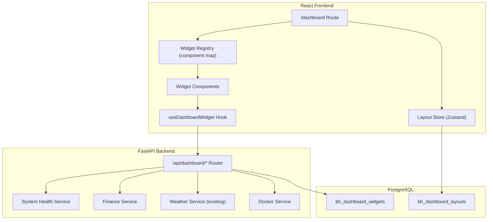

# Design Document: Dashboard Integration

## Overview

This design integrates the personal dashboard as a first-class `/dashboard` route inside BowersHub AI, replacing the standalone Flask dashboard (port 8080). The dashboard shares authentication, theming, and data access with the rest of the app, delivering a single-PWA experience on the Pixel 9 Pro and desktop.

The architecture follows BowersHub AI's established patterns:
- **Backend**: A new `backend/routers/dashboard.py` FastAPI router with data-fetching endpoints under `/api/dashboard/`
- **Frontend**: A `DashboardPage` React component at `/dashboard` with a widget registry pattern modeled after the backend skill registry
- **Database**: Two new tables (`bh_dashboard_widgets`, `bh_dashboard_layouts`) for DB-driven widget configuration and layout persistence
- **Extensibility**: Adding a new widget = React component file + component map entry + DB INSERT (mirrors the skill pattern)

### Migration from Standalone Dashboard

The standalone Flask dashboard (`/home/michael/KiroProject/dashboard/`) currently provides:
- Weather, System Health, Containers, Finance, Transactions, Inventory, Knowledge Base, Tailscale, Emails, API Spend tiles
- Gridstack.js drag-and-drop layouts with localStorage persistence
- Flask proxy endpoints for CORS avoidance

All of this functionality moves into BowersHub AI natively. Once verified, the `dashboard` Docker container is retired. The iframe link in the Sidebar (`📊` → port 8080) will be replaced with a `react-router` navigation to `/dashboard`.

## Architecture



### Key Design Decisions

1. **Widget Registry in DB, not code** — Aligns with the project's "NO HARDCODING" rule. New widget types are added via migration INSERT, not frontend code changes (other than the React component itself).

2. **Per-widget independent data fetching** — Each widget uses the `useDashboardWidget` hook which fetches, caches, polls, and handles errors independently. One widget timing out doesn't block others.

3. **Layout persistence in Postgres** — Unlike the old dashboard's localStorage approach, layouts persist across devices (phone ↔ desktop). The single-user PWA on Pixel 9 Pro + desktop browser both see the same layout.

4. **Reuse existing services** — Weather already exists in `backend/services/weather.py`. Finance queries use the existing asyncpg pool. The dashboard router orchestrates calls to these, avoiding code duplication.

5. **Single-column mobile, grid desktop** — Mobile-first responsive: stacked cards on Pixel 9 Pro, multi-column grid on desktop. No drag-and-drop on mobile (move-up/move-down buttons instead).

## Components and Interfaces

### Frontend Components

```
frontend/src/
├── pages/
│   └── DashboardPage.tsx          # Main page, handles tab navigation + layout
├── components/dashboard/
│   ├── WidgetRegistry.ts          # Maps widget_key → lazy React component
│   ├── WidgetShell.tsx            # Common widget chrome (card, header, error/stale states)
│   ├── WidgetGrid.tsx             # Responsive grid layout (CSS Grid, not a library)
│   ├── DashboardNav.tsx           # Page tabs (Overview / Finance / System)
│   ├── AddWidgetModal.tsx         # Widget picker for adding to a page
│   └── widgets/
│       ├── WeatherWidget.tsx
│       ├── FinanceSummaryWidget.tsx
│       ├── BalancesWidget.tsx
│       ├── RecentTransactionsWidget.tsx
│       ├── SystemHealthWidget.tsx
│       ├── ContainersWidget.tsx
│       ├── InventoryWidget.tsx
│       ├── KnowledgeBaseWidget.tsx
│       ├── RecentEmailsWidget.tsx
│       ├── TailscaleWidget.tsx
│       ├── ApiSpendWidget.tsx
│       └── SportsScoresWidget.tsx
├── hooks/
│   └── useDashboardWidget.ts      # Data fetching + caching + polling + error handling
└── stores/
    └── dashboard.ts               # Zustand store for layouts + available widgets
```

### Backend Endpoints

```
backend/routers/dashboard.py

GET  /api/dashboard/widgets          → List available widget types from registry
GET  /api/dashboard/layouts          → Get user's saved layouts (all pages)
PUT  /api/dashboard/layouts          → Persist updated layouts

GET  /api/dashboard/system-health    → CPU, memory, disk, uptime
GET  /api/dashboard/containers       → Docker container list with status

GET  /api/dashboard/finance/summary  → MTD spending, top categories, delta
GET  /api/dashboard/finance/balances → Account balances grouped by type
GET  /api/dashboard/finance/recent-transactions → Last 10 transactions

GET  /api/dashboard/weather          → Current + 3-day forecast (delegates to existing service)

GET  /api/dashboard/inventory        → Item counts per inventory table
GET  /api/dashboard/knowledge        → Knowledge base file count
GET  /api/dashboard/emails           → Recent email count + last 5 subjects
GET  /api/dashboard/tailscale        → Device list with online status
GET  /api/dashboard/api-spend        → 7-day Anthropic usage breakdown
```

### Widget Registry Pattern (Frontend)

```typescript
// WidgetRegistry.ts
import { lazy, ComponentType } from 'react'

export interface WidgetDefinition {
  component: React.LazyExoticComponent<ComponentType<WidgetProps>>
}

export interface WidgetProps {
  config: Record<string, any>   // Per-instance config overrides from layout
  widgetDef: WidgetType         // Full widget definition from DB
}

// Component map: widget_key → lazy-loaded component
const WIDGET_COMPONENTS: Record<string, WidgetDefinition> = {
  'weather':              { component: lazy(() => import('./widgets/WeatherWidget')) },
  'finance_summary':      { component: lazy(() => import('./widgets/FinanceSummaryWidget')) },
  'finance_balances':     { component: lazy(() => import('./widgets/BalancesWidget')) },
  'recent_transactions':  { component: lazy(() => import('./widgets/RecentTransactionsWidget')) },
  'system_health':        { component: lazy(() => import('./widgets/SystemHealthWidget')) },
  'containers':           { component: lazy(() => import('./widgets/ContainersWidget')) },
  'inventory':            { component: lazy(() => import('./widgets/InventoryWidget')) },
  'knowledge_base':       { component: lazy(() => import('./widgets/KnowledgeBaseWidget')) },
  'recent_emails':        { component: lazy(() => import('./widgets/RecentEmailsWidget')) },
  'tailscale_devices':    { component: lazy(() => import('./widgets/TailscaleWidget')) },
  'api_spend':            { component: lazy(() => import('./widgets/ApiSpendWidget')) },
  'sports_scores':        { component: lazy(() => import('./widgets/SportsScoresWidget')) },
}

export function getWidgetComponent(key: string): WidgetDefinition | undefined {
  return WIDGET_COMPONENTS[key]
}
```

### useDashboardWidget Hook

```typescript
// hooks/useDashboardWidget.ts
interface UseDashboardWidgetOptions {
  endpoint: string           // e.g., '/api/dashboard/weather'
  pollingInterval?: number   // ms, default 60000
  timeout?: number           // ms, default 10000
}

interface UseDashboardWidgetResult<T> {
  data: T | null
  error: string | null
  isLoading: boolean
  isStale: boolean
  lastFetched: Date | null
  refresh: () => void
}
```

The hook:
1. Fetches from `endpoint` on mount
2. Caches the last successful response in memory
3. Re-fetches on the configured `pollingInterval`
4. If a fetch fails, keeps the cached data and sets `isStale: true`
5. Enforces a `timeout` (default 10s) — treats timeouts as failures
6. Exposes `refresh()` for manual pull-to-refresh

### Backend Router Structure

```python
# backend/routers/dashboard.py
from fastapi import APIRouter, Depends
router = APIRouter(prefix="/api/dashboard", tags=["dashboard"])

# Widget registry
@router.get("/widgets")
async def list_widgets() -> list[dict]: ...

# Layouts
@router.get("/layouts")
async def get_layouts(user_id: int = Depends(get_current_user_id)) -> dict: ...

@router.put("/layouts")
async def save_layouts(body: LayoutUpdate, user_id: int = Depends(...)) -> dict: ...

# Data endpoints (each returns JSON, handles its own errors)
@router.get("/system-health")
async def system_health() -> dict: ...

@router.get("/containers")
async def containers() -> dict: ...

# ... etc
```

## Data Models

### Database Schema

```sql
-- Migration: 017_dashboard_integration.sql

-- Widget type registry (what widgets are available)
CREATE TABLE public.bh_dashboard_widgets (
    id              SERIAL PRIMARY KEY,
    widget_key      TEXT NOT NULL UNIQUE,           -- 'weather', 'finance_summary', etc.
    display_name    TEXT NOT NULL,                  -- 'Weather'
    description     TEXT,                           -- 'Current conditions + 3-day forecast'
    category        TEXT NOT NULL DEFAULT 'general', -- 'general', 'finance', 'system'
    data_endpoint   TEXT NOT NULL,                  -- '/api/dashboard/weather'
    default_config  JSONB NOT NULL DEFAULT '{}'::jsonb,  -- polling_interval_ms, location, etc.
    default_pages   JSONB NOT NULL DEFAULT '[]'::jsonb,  -- which pages include this by default
    sort_order      INTEGER NOT NULL DEFAULT 0,
    is_active       BOOLEAN NOT NULL DEFAULT true,
    created_at      TIMESTAMPTZ NOT NULL DEFAULT now()
);

-- User layout persistence (arrangement per page)
CREATE TABLE public.bh_dashboard_layouts (
    id              SERIAL PRIMARY KEY,
    user_id         INTEGER NOT NULL REFERENCES public.bh_users(id) ON DELETE CASCADE,
    page_key        TEXT NOT NULL,                  -- 'overview', 'finance', 'system'
    widgets         JSONB NOT NULL DEFAULT '[]'::jsonb,
    -- widgets is an array of: { widget_key, config_overrides, position }
    updated_at      TIMESTAMPTZ NOT NULL DEFAULT now(),
    UNIQUE(user_id, page_key)
);

CREATE INDEX idx_dashboard_layouts_user ON public.bh_dashboard_layouts(user_id);
```

### Widget Layout JSON Structure

The `widgets` column in `bh_dashboard_layouts` stores an ordered array:

```json
[
  {
    "widget_key": "weather",
    "position": 0,
    "config_overrides": { "location": "Clawson,MI" }
  },
  {
    "widget_key": "finance_summary",
    "position": 1,
    "config_overrides": {}
  },
  {
    "widget_key": "containers",
    "position": 2,
    "config_overrides": {
      "links": {
        "n8n": "http://100.106.180.101:5678",
        "bowershub-ai": "https://595bowershub.tailc4d58a.ts.net"
      }
    }
  }
]
```

### Default Page Configurations (Seed Data)

**Overview page**: Weather, Finance Summary, Containers, Recent Emails, Sports Scores
**Finance page**: Finance Summary, Balances, Recent Transactions, API Spend
**System page**: System Health, Containers, Tailscale Devices, Inventory, Knowledge Base

### TypeScript Types

```typescript
// stores/dashboard.ts
interface WidgetType {
  id: number
  widget_key: string
  display_name: string
  description: string
  category: string
  data_endpoint: string
  default_config: Record<string, any>
}

interface WidgetInstance {
  widget_key: string
  position: number
  config_overrides: Record<string, any>
}

interface PageLayout {
  page_key: string
  widgets: WidgetInstance[]
}

interface DashboardState {
  availableWidgets: WidgetType[]
  layouts: Record<string, PageLayout>  // page_key → layout
  activePage: string
  isLoading: boolean

  loadDashboard: () => Promise<void>
  setActivePage: (page: string) => void
  addWidget: (pageKey: string, widgetKey: string) => Promise<void>
  removeWidget: (pageKey: string, widgetKey: string) => Promise<void>
  reorderWidgets: (pageKey: string, widgets: WidgetInstance[]) => Promise<void>
}
```

### System Health Response Shape

```typescript
interface SystemHealthResponse {
  cpu_percent: number
  memory: { used_bytes: number, total_bytes: number, percent: number }
  disk: Array<{ mount: string, used_bytes: number, total_bytes: number, percent: number }>
  uptime_seconds: number
}
```

### Container Response Shape

```typescript
interface ContainerResponse {
  containers: Array<{
    name: string
    status: 'running' | 'stopped' | 'restarting' | 'exited'
    image: string
    ports: string
    uptime: string
    web_url?: string   // from widget config, not Docker
  }>
  error?: string       // set when Docker daemon unreachable
}
```


## Correctness Properties

*A property is a characteristic or behavior that should hold true across all valid executions of a system — essentially, a formal statement about what the system should do. Properties serve as the bridge between human-readable specifications and machine-verifiable correctness guarantees.*

### Property 1: Widget rendering matches registry

*For any* set of widget_keys returned by the backend widget registry, the dashboard SHALL render a widget if and only if that widget_key has a corresponding entry in the client-side component map. Unknown keys are silently skipped without errors.

**Validates: Requirements 2.3, 2.4**

### Property 2: Layout persistence round-trip

*For any* valid layout configuration (any list of widget instances in any order with any config overrides), persisting via `PUT /api/dashboard/layouts` and then retrieving via `GET /api/dashboard/layouts` SHALL produce an identical widget list with the same ordering and config values.

**Validates: Requirements 3.2, 3.4**

### Property 3: Widget failure independence

*For any* set of dashboard widgets being rendered, if one widget's data fetch fails (timeout, HTTP error, or exception), all other widgets on the same page SHALL continue to render their data unaffected.

**Validates: Requirements 6.1**

### Property 4: Stale data caching on failure

*For any* widget that has previously fetched data successfully, if the next fetch attempt fails, the widget SHALL display the previously cached data and mark itself as stale with the timestamp of the last successful fetch.

**Validates: Requirements 6.2**

### Property 5: Partial response resilience

*For any* dashboard data endpoint that aggregates multiple sub-sections (e.g., system-health aggregates CPU + memory + disk + Docker), if one sub-section's data source is unreachable, the endpoint SHALL still return the successful sub-sections with an error flag indicating which sub-section failed — never a complete endpoint failure.

**Validates: Requirements 7.3, 11.2**

### Property 6: Graceful SQL error handling

*For any* finance dashboard query, if the underlying SQL fails due to a missing column, missing table, or schema mismatch, the endpoint SHALL return a structured error response containing the SQL error message rather than raising an unhandled exception or returning a 500.

**Validates: Requirements 8.4**

## Error Handling

### Frontend Error Handling

| Scenario | Behavior |
|----------|----------|
| Widget data fetch fails (first time) | Show error message within widget bounds. Other widgets unaffected. |
| Widget data fetch fails (has cache) | Show cached data + "stale" badge with last-updated timestamp. Retry on next poll. |
| Widget fetch timeout (>10s) | Treat as failure. Same behavior as fetch error. |
| Unknown widget_key from backend | Skip rendering. Log to console (dev mode only). No user-visible error. |
| Layout API unreachable | Use in-memory layout state. Queue persist retry. Show subtle "offline" indicator. |
| Widget component throws during render | React Error Boundary catches per-widget. Show "Widget unavailable" in that slot. |

### Backend Error Handling

| Scenario | Behavior |
|----------|----------|
| Docker daemon unreachable | `/containers` returns `{ containers: [], error: "Docker daemon unreachable" }`. `/system-health` still returns CPU/mem/disk with `docker_error` flag. |
| Finance table/column missing | Return `{ error: true, message: "column X does not exist", data: null }` with HTTP 200 (not 500) so the widget can show the error gracefully. |
| wttr.in unreachable | Return `{ error: true, message: "Weather service unavailable" }`. |
| Gmail IMAP unreachable | Email endpoint returns `{ error: true, message: "...", count: null, emails: [] }`. |
| Tailscale CLI not found | Return `{ error: true, message: "tailscale not available" }`. |
| Layout save fails (DB error) | Return HTTP 500 with error detail. Frontend retries once, then alerts user. |

### Error Boundary Strategy

Each widget is wrapped in an individual React Error Boundary (`WidgetShell` component). If a widget's render function throws, the boundary catches it and renders a fallback card with "Widget unavailable — tap to retry" without affecting the rest of the page. This matches the "one broken tile doesn't take down the dashboard" requirement.

## Testing Strategy

### Unit Tests

Unit tests cover specific behaviors and edge cases:

- **WidgetRegistry**: Verify `getWidgetComponent` returns the correct component for known keys and `undefined` for unknown keys
- **useDashboardWidget hook**: Test timeout enforcement, stale state transition, cache retention on error
- **Layout store**: Test add/remove/reorder mutations, default layout fallback logic
- **Backend endpoints**: Test response shape validation, error response formatting, SQL error wrapping
- **System health service**: Test CPU/memory/disk parsing from psutil output
- **Finance service**: Test MTD calculation, category grouping, balance aggregation

### Property-Based Tests

Property-based tests validate the correctness properties above using [Hypothesis](https://hypothesis.readthedocs.io/) (Python backend) and [fast-check](https://fast-check.dev/) (TypeScript frontend).

**Configuration**: Minimum 100 iterations per property test.

**Tag format**: `Feature: dashboard-integration, Property {number}: {property_text}`

| Property | Library | What's Generated |
|----------|---------|------------------|
| 1: Widget rendering matches registry | fast-check | Random sets of widget_keys (mix of known + unknown) |
| 2: Layout persistence round-trip | Hypothesis | Random layout configurations (varying widget counts, orders, config objects) |
| 3: Widget failure independence | fast-check | Random widget sets + random failure injection points |
| 4: Stale data caching | fast-check | Random data payloads followed by random error types |
| 5: Partial response resilience | Hypothesis | Random sub-section failure combinations across endpoints |
| 6: Graceful SQL error handling | Hypothesis | Random invalid column/table names injected into finance queries |

### Integration Tests

- **Full dashboard load**: Verify the `/dashboard` route mounts, fetches widgets + layouts, renders without errors
- **Theme reactivity**: Change theme, verify CSS variables update on widget elements
- **Mobile responsive**: Viewport resize triggers layout change (single-col ↔ multi-col)
- **Docker integration**: Verify container list endpoint works when Docker is available
- **Finance queries**: Verify real SQL execution against test database with seeded data

### Migration Testing

- Verify migration 017 applies cleanly to the existing schema
- Verify seed data creates all expected widget types
- Verify default layouts are generated for the admin user

### What Gets Retired

Once the integrated dashboard is verified:
1. Stop the `dashboard` Docker container (`docker stop dashboard`)
2. Remove the `📊` external link from `Sidebar.tsx` — replace with `<Link to="/dashboard">`
3. Keep the `dashboard/` source in the repo for 30 days as rollback reference
4. Remove from `infrastructure/docker-compose.yml` after confidence period
