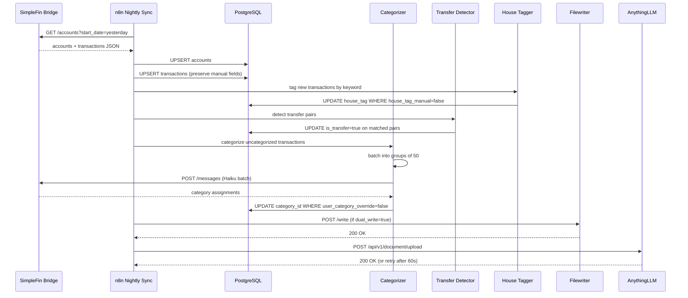

# Design Document: Financial AI Advisor

## Overview

The Financial AI Advisor upgrades the existing SimpleFin → n8n → JSON → AnythingLLM pipeline by introducing a PostgreSQL database as the authoritative data store. The core problem with the current architecture is that RAG over flat JSON files only retrieves semantically relevant chunks — meaning the AI misses large portions of transaction history when answering questions like "how much did I spend on groceries in the last 6 months."

The new architecture replaces chunk retrieval with precise SQL queries. n8n webhooks become SQL-backed endpoints that return complete, accurate data. The AnythingLLM Finance Workspace system prompt is redesigned to call these webhooks first rather than relying on embedded documents. AI-assisted categorization (Haiku), transfer detection, house tagging, and budget alerts are layered on top of the Postgres foundation.

The migration is designed to be safe: a `dual_write` flag keeps JSON files flowing during the transition, and all upsert operations preserve manually-set fields so no human overrides are lost.

### High-Level Architecture

```mermaid
graph TB
    subgraph External
        SF[SimpleFin Bridge<br/>17 bank accounts]
        ANT[Anthropic API<br/>Haiku / Sonnet]
    end

    subgraph "595BowersHub Docker Network"
        subgraph "n8n Workflows"
            HS[Historical Load<br/>manual trigger]
            NS[Nightly Sync<br/>2am daily]
            BA[Budget Alert<br/>8am daily]
            WB[Webhooks<br/>balances / transactions / filter]
        end

        subgraph "New Components"
            CAT[Categorizer<br/>sub-workflow]
            TD[Transfer Detector<br/>sub-workflow]
            HT[House Tagger<br/>inline logic]
        end

        PG[(PostgreSQL<br/>postgres:5432)]
        FW[Filewriter<br/>:5001]
        ALLM[AnythingLLM<br/>:3001]
    end

    subgraph "Host Filesystem"
        JSON[/home/michael/finance/<br/>*.json files]
        PGVOL[/home/michael/finance/<br/>postgres-data/]
    end

    SF -->|fetch| HS
    SF -->|fetch| NS
    HS -->|upsert| PG
    NS -->|upsert| PG
    NS -->|dual_write| FW
    FW --> JSON
    NS -->|embed| ALLM
    PG --> PGVOL

    HS --> CAT
    NS --> CAT
    CAT -->|Haiku batch| ANT
    CAT -->|write category_id| PG

    NS --> TD
    TD -->|set is_transfer| PG

    NS --> HT
    HT -->|set house_tag| PG

    BA -->|query| PG
    BA -->|HTTP POST| NTFY[ntfy.sh / Slack / Discord]

    WB -->|SQL query| PG
    ALLM -->|GET webhooks| WB
    ALLM -->|chat| ANT
```

### Key Design Decisions

- **Postgres over SQLite**: SQLite has no network access from Docker containers; Postgres is the standard choice for multi-container setups and supports concurrent writes from multiple n8n workflow executions.
- **Upsert-first writes**: All writes use `INSERT ... ON CONFLICT DO UPDATE` so workflows are safe to re-run at any time without creating duplicates.
- **Manual override flags**: Three boolean flags (`user_category_override`, `house_tag_manual`, `is_transfer_manual`) protect human-set values from being overwritten by automation. This is the same pattern used by Monarch Money and YNAB.
- **Webhook-first AI**: The AnythingLLM system prompt instructs the AI to call webhooks before answering, so responses are based on live SQL results rather than stale embedded chunks.
- **Dual-write migration**: The `dual_write` flag in n8n workflow settings keeps JSON files flowing during the transition period, so the existing embedding workflow is not broken while Postgres is being validated.

---

## Architecture

### Component Interaction



### Docker Network Topology

All containers run on a shared Docker bridge network (`ai-network` or equivalent, managed via Portainer). The Postgres container joins this same network so n8n can reach it at `postgres:5432` without exposing the port to the host.

```
Docker bridge network: ai-network
├── n8n          (hostname: n8n,          port 5678 exposed to host)
├── anythingllm  (hostname: anythingllm,  port 3001 exposed to host)
├── filewriter   (hostname: filewriter,   port 5001 exposed to host)
└── postgres     (hostname: postgres,     port 5432 NOT exposed to host)
```

Postgres port 5432 is intentionally not exposed to the host — it is only reachable from within the Docker network. This is the correct security posture for a database that should only be accessed by application containers.

---

## Components and Interfaces

### 1. PostgreSQL Container

Deployed as a new service in the existing `ai-services` Portainer stack. The container uses the official `postgres:16-alpine` image (small footprint, LTS support).

**docker-compose snippet** (to be merged into the existing ai-services stack):

```yaml
services:
  postgres:
    image: postgres:16-alpine
    container_name: postgres
    hostname: postgres
    restart: unless-stopped
    environment:
      POSTGRES_DB: finance
      POSTGRES_USER: finance_user
      POSTGRES_PASSWORD: ${POSTGRES_PASSWORD}   # set in Portainer stack env vars
    volumes:
      - /home/michael/finance/postgres-data:/var/lib/postgresql/data
      - /home/michael/finance/init:/docker-entrypoint-initdb.d:ro
    networks:
      - ai-network
    healthcheck:
      test: ["CMD-SHELL", "pg_isready -U finance_user -d finance"]
      interval: 30s
      timeout: 10s
      retries: 3

networks:
  ai-network:
    external: true
```

The `/home/michael/finance/init/` directory on the host contains the `01_init.sql` file. Postgres automatically runs all `.sql` files in `/docker-entrypoint-initdb.d/` on first startup (when the data directory is empty).

### 2. n8n Postgres Node Configuration

n8n has a built-in Postgres node. A single credential entry is created once in n8n:

- **Credential name**: `Finance Postgres`
- **Host**: `postgres`
- **Port**: `5432`
- **Database**: `finance`
- **User**: `finance_user`
- **Password**: (from Portainer env var `POSTGRES_PASSWORD`)
- **SSL**: disabled (internal Docker network)

All n8n workflows use this credential. The Postgres node supports Execute Query, Insert, Update, and Upsert operations natively.

### 3. n8n Workflow Upgrades

The 5 existing workflows are upgraded as follows:

| Workflow | Current Output | New Output | Change |
|---|---|---|---|
| Historical Load | JSON file via Filewriter | Postgres upsert + optional JSON | Replace HTTP→Filewriter with Postgres node; add Categorizer sub-workflow call |
| Nightly Sync | JSON file via Filewriter | Postgres upsert + JSON (dual_write) + embed | Add Postgres node; keep Filewriter for dual_write; add embed step |
| Balance Webhook | SimpleFin API call | Postgres SELECT | Replace SimpleFin HTTP call with Postgres query |
| Date-Range Webhook | SimpleFin API call | Postgres SELECT | Replace SimpleFin HTTP call with Postgres query |
| Filter Webhook | SimpleFin API call | Postgres SELECT | Replace SimpleFin HTTP call with Postgres query |

**New workflows added:**
- Budget Alert (daily 8am schedule)
- Categorizer (sub-workflow, called by Historical Load and Nightly Sync)

### 4. Categorizer Sub-Workflow

Called by both Historical Load and Nightly Sync. Accepts a list of transaction objects and returns them with `category_id` populated.

**Node structure:**
```
Input (transaction list)
  → Code: Filter out user_category_override=true
  → Code: Split into batches of 50
  → Loop: For each batch
      → HTTP Request: POST to Anthropic API (Haiku)
      → Code: Parse response, validate category names
      → Code: Map category names to category_ids
      → Postgres: UPDATE transactions SET category_id=... WHERE id=...
  → Output: updated transaction list
```

**Haiku API call structure:**

```json
{
  "model": "claude-haiku-4-5",
  "max_tokens": 1024,
  "messages": [
    {
      "role": "user",
      "content": "Categorize each of the following bank transactions. For each transaction, return ONLY the category name from this exact list: Groceries, Dining, Gas, Transportation, Utilities, Subscriptions, Mortgage, Rent, Insurance, Medical, Shopping, Entertainment, Transfer, Income, ATM, Home_Improvement, Other.\n\nReturn a JSON array with one object per transaction in the same order: [{\"id\": \"<transaction_id>\", \"category\": \"<category_name>\"}, ...]\n\nTransactions:\n<TRANSACTIONS_JSON>"
    }
  ]
}
```

Where `<TRANSACTIONS_JSON>` is a JSON array of objects:
```json
[
  {"id": "txn_abc123", "description": "WHOLE FOODS MARKET", "memo": "", "amount": -87.43},
  {"id": "txn_def456", "description": "SHELL OIL 12345", "memo": "", "amount": -52.10}
]
```

**Fallback logic** (in the Code node after the HTTP Request):
- If the HTTP Request node returns an error or times out (30s timeout configured on the node): assign `Other` to all transactions in the batch, set a `categorization_failed` flag for retry tracking.
- If the response contains a category name not in the valid list: assign `Other` to that specific transaction.
- If the response JSON cannot be parsed: assign `Other` to all transactions in the batch.

### 5. Transfer Detector Sub-Workflow

Runs after the upsert step in Nightly Sync. Operates on the newly upserted transactions only (not the full history) to keep execution time short.

**Algorithm:**

```
1. Query: SELECT all new transactions from this sync run
2. Separate into debits (amount < 0) and credits (amount > 0)
3. For each debit:
   a. Find all credits where:
      - ABS(credit.amount) == ABS(debit.amount)
      - credit.posted_date BETWEEN debit.posted_date AND debit.posted_date + 3 days
      - credit.account_id != debit.account_id
      - credit.is_transfer_manual = false
      - debit.is_transfer_manual = false
   b. If exactly one match: mark both as is_transfer=true, category=Transfer
   c. If multiple matches: select the one with MIN(ABS(credit.posted_date - debit.posted_date))
      - Mark the winning pair as is_transfer=true, category=Transfer
      - Leave other candidates unmodified
   d. If no match but description/memo contains transfer keyword:
      - Set is_transfer=false (already default)
      - Append " | POTENTIAL TRANSFER - REVIEW NEEDED" to memo
4. Write all updates to Postgres in a single batch UPDATE
```

**Transfer keywords** (stored as n8n workflow config variable):
```json
["Zelle", "Venmo", "ACH Transfer", "Wire Transfer", "Internal Transfer", "XFER", "Transfer From", "Transfer To"]
```

**n8n implementation note**: The matching logic runs in a Code node using JavaScript. The node receives the list of new transactions as input, performs the matching in memory, and outputs a list of `{id, is_transfer, category_id, memo}` update objects. A subsequent Postgres node executes the batch update.

### 6. House Tagger

Inline logic in the Nightly Sync and Historical Load workflows, runs after the upsert step. Implemented as a single Code node.

**Keyword list** (stored as a workflow-level variable named `HOUSE_KEYWORDS`, editable in the workflow settings without touching node code):

```json
[
  "595 Bowers", "595Bowers", "Bowers",
  "Home Depot", "Lowes", "Lowe's",
  "Mortgage", "HOA", "Property Tax",
  "Pest Control", "Lawn", "Landscaping",
  "Plumber", "Electrician", "HVAC",
  "Roto-Rooter", "ServiceMaster"
]
```

**Logic** (Code node):
```javascript
const keywords = $workflow.variables.HOUSE_KEYWORDS; // JSON array
const transactions = $input.all();

return transactions.map(txn => {
  // Skip if manually tagged
  if (txn.json.house_tag_manual === true) return txn;
  
  const searchText = [
    txn.json.description || '',
    txn.json.memo || ''
  ].join(' ').toLowerCase();
  
  const isHouse = keywords.some(kw => 
    searchText.includes(kw.toLowerCase())
  );
  
  return {
    ...txn,
    json: { ...txn.json, house_tag: isHouse }
  };
});
```

A subsequent Postgres node updates `house_tag` for all transactions where `house_tag_manual = false`.

### 7. Budget Alert Workflow

**Node structure:**
```
Schedule Trigger (8am daily, America/New_York)
  → Postgres: Query current month spending by category (excluding transfers)
  → Postgres: Query budget limits for current month
  → Code: Join spending vs limits, calculate percentages
  → Code: Filter to categories at ≥80% (check dedup)
  → Postgres: Query alert_log for today's already-sent alerts
  → Code: Remove already-alerted categories
  → IF: Any alerts remaining?
      → Loop: For each alert
          → HTTP Request: POST notification
          → Postgres: INSERT into alert_log
```

**Deduplication approach**: An `alert_log` table (see Data Models) records each sent alert with `category_id`, `alert_type` (80pct or 100pct), and `alert_date`. Before sending, the workflow queries this table for today's date and filters out already-sent alerts.

**Notification payload** (compatible with ntfy.sh, Slack, and Discord):

```json
{
  "category": "Groceries",
  "amount_spent": 342.18,
  "budget_limit": 400.00,
  "percentage_used": 86,
  "message": "⚠️ Groceries: $342.18 of $400.00 (86%) — approaching limit",
  "title": "Budget Alert: Groceries at 86%"
}
```

For ntfy.sh: POST to `https://ntfy.sh/<topic>` with the `message` field as the body and `title` as the `Title` header.
For Slack/Discord: the entire JSON body is sent as-is; the webhook URL is configured to accept it.

The notification URL is stored as an n8n environment variable `BUDGET_ALERT_WEBHOOK_URL`.

### 8. Finance Workspace System Prompt

The AnythingLLM Finance Workspace system prompt is redesigned around a webhook-first instruction pattern. The AI is told to always call webhooks before answering financial questions, never to rely on embedded documents for current data.

**System prompt design:**

```
You are Michael's personal Financial AI Advisor. You have access to live financial data 
through the following n8n webhook endpoints. ALWAYS call the appropriate webhook before 
answering any financial question. Do not rely on embedded documents for current data.

## Available Webhooks

GET http://100.106.180.101:5678/webhook/balances
- Returns current balances for all 17 bank accounts
- Use for: "what's my balance", "how much do I have", account balance questions

GET http://100.106.180.101:5678/webhook/transactions?start=YYYY-MM-DD&end=YYYY-MM-DD
- Returns all transactions in the date range
- Use for: questions spanning more than 90 days, full month/year summaries
- Required params: start, end (YYYY-MM-DD format)

GET http://100.106.180.101:5678/webhook/filter?account=NAME&min_amount=X&max_amount=Y&description=KEYWORD&category=NAME&house_tag=true
- Returns filtered transactions (all params optional, defaults to last 90 days)
- Use for: category spending, keyword searches, house expenses, single-account queries

## Routing Rules

- Single account or single category lookup → use Haiku (fast, cheap)
- Multi-account aggregation or date range > 90 days → use Sonnet (more capable)
- Balance queries → always use /webhook/balances, data is ≤24 hours stale
- House/home/595 Bowers/property queries → use /webhook/filter?house_tag=true
- Spending/expenses/totals/budget queries → EXCLUDE transfers (already filtered by SQL)
- If a webhook returns an error → tell Michael which endpoint failed and suggest checking n8n at http://100.106.180.101:5678

## Response Format

Always include:
- The specific date range or filter used
- Total amount (sum of amounts)
- Transaction count
- Top 5 transactions by amount when relevant
- Comparison to prior period when asked
```

**Sonnet vs Haiku routing**: AnythingLLM does not natively support per-query model switching. The routing is implemented via two separate workspaces or via the system prompt instructing the AI to indicate which model it would use. For the initial implementation, the workspace uses Sonnet as the default (handles all query types) with a note to switch to Haiku once the webhook-first pattern is validated and costs are understood.

### 9. Auto-Embedding Flow

Added as the final step in the Nightly Sync workflow, after the Filewriter step.

**Node structure:**
```
[After Filewriter step]
  → HTTP Request: POST to AnythingLLM upload API
  → IF: Success (status 200)?
      → Code: Log success (filename + timestamp)
  → ELSE:
      → Wait: 60 seconds
      → HTTP Request: POST to AnythingLLM upload API (retry)
      → IF: Success?
          → Code: Log success
      → ELSE:
          → Code: Log failure (filename, attempt=2, timestamp)
          → [Continue — do not fail the workflow]
```

**AnythingLLM upload API call:**

```
POST http://anythingllm:3001/api/v1/document/upload
Authorization: Bearer <ANYTHINGLLM_API_KEY>
Content-Type: multipart/form-data

file: <binary content of the daily JSON file>
```

The file content is retrieved from the Filewriter response or re-read via a second Filewriter GET call. The `ANYTHINGLLM_API_KEY` is stored as an n8n environment variable.

After upload, a second call adds the document to the Finance Workspace:

```
POST http://anythingllm:3001/api/v1/workspace/finance/update-embeddings
Authorization: Bearer <ANYTHINGLLM_API_KEY>
Content-Type: application/json

{
  "adds": ["custom-documents/<uploaded_filename>"],
  "deletes": []
}
```

### 10. Dual-Write Migration Strategy

The migration from JSON-only to Postgres-primary is controlled by a single boolean workflow variable `DUAL_WRITE` in the Nightly Sync and Historical Load workflows.

**Migration phases:**

| Phase | DUAL_WRITE | Postgres | JSON Files | AnythingLLM Source |
|---|---|---|---|---|
| 1 — Validation | `true` | Write + read | Still written | Embedded docs (unchanged) |
| 2 — Parallel | `true` | Primary for webhooks | Still written | Webhooks (system prompt updated) |
| 3 — Postgres-only | `false` | Primary | Stopped | Webhooks only |

**Phase 1** (first 1-2 weeks): Deploy Postgres, run Historical Load to populate it, keep writing JSON files. Validate that webhook queries return correct data by comparing against JSON files manually.

**Phase 2** (weeks 2-4): Update the AnythingLLM system prompt to use webhooks. Keep writing JSON files as a safety net. Monitor AI response quality.

**Phase 3** (after validation): Set `DUAL_WRITE=false`. JSON files stop being written. Postgres is the sole data store.

**Rollback**: If Postgres becomes unavailable, set `DUAL_WRITE=true` and revert the system prompt. The JSON files from Phase 1-2 are still on disk and can be re-embedded.

---

## Data Models

### Full DDL

```sql
-- ============================================================
-- Finance Database Schema
-- File: /home/michael/finance/init/01_init.sql
-- ============================================================

-- Categories (seed data included)
CREATE TABLE IF NOT EXISTS categories (
    id          SERIAL PRIMARY KEY,
    name        VARCHAR(64) NOT NULL UNIQUE,
    budget_monthly NUMERIC(10,2),          -- default monthly budget, nullable
    is_system   BOOLEAN NOT NULL DEFAULT false
);

-- Pre-seed system categories
INSERT INTO categories (name, is_system) VALUES
    ('Groceries',        true),
    ('Dining',           true),
    ('Gas',              true),
    ('Transportation',   true),
    ('Utilities',        true),
    ('Subscriptions',    true),
    ('Mortgage',         true),
    ('Rent',             true),
    ('Insurance',        true),
    ('Medical',          true),
    ('Shopping',         true),
    ('Entertainment',    true),
    ('Transfer',         true),
    ('Income',           true),
    ('ATM',              true),
    ('Home_Improvement', true),
    ('Other',            true)
ON CONFLICT (name) DO NOTHING;

-- Accounts (one row per SimpleFin account)
CREATE TABLE IF NOT EXISTS accounts (
    id                  VARCHAR(128) PRIMARY KEY,  -- SimpleFin account id
    org_name            VARCHAR(256),              -- bank/institution name
    account_name        VARCHAR(256),              -- account display name
    currency            VARCHAR(8) NOT NULL DEFAULT 'USD',
    last_balance        NUMERIC(12,2),
    last_balance_date   DATE,
    created_at          TIMESTAMPTZ NOT NULL DEFAULT NOW(),
    updated_at          TIMESTAMPTZ NOT NULL DEFAULT NOW()
);

-- Transactions
CREATE TABLE IF NOT EXISTS transactions (
    id                      VARCHAR(128) PRIMARY KEY,  -- SimpleFin transaction id
    account_id              VARCHAR(128) NOT NULL REFERENCES accounts(id),
    posted_date             DATE NOT NULL,
    amount                  NUMERIC(12,2) NOT NULL,
    description             TEXT,
    memo                    TEXT,
    pending                 BOOLEAN NOT NULL DEFAULT false,

    -- Categorization
    category_id             INTEGER REFERENCES categories(id),
    user_category_override  BOOLEAN NOT NULL DEFAULT false,  -- protects category_id from automation

    -- Transfer detection
    is_transfer             BOOLEAN NOT NULL DEFAULT false,
    is_transfer_manual      BOOLEAN NOT NULL DEFAULT false,  -- protects is_transfer from automation

    -- House tagging
    house_tag               BOOLEAN NOT NULL DEFAULT false,
    house_tag_manual        BOOLEAN NOT NULL DEFAULT false,  -- protects house_tag from automation

    -- Metadata
    created_at              TIMESTAMPTZ NOT NULL DEFAULT NOW(),
    updated_at              TIMESTAMPTZ NOT NULL DEFAULT NOW()
);

-- Budgets (monthly limits per category)
CREATE TABLE IF NOT EXISTS budgets (
    id              SERIAL PRIMARY KEY,
    category_id     INTEGER NOT NULL REFERENCES categories(id),
    month           DATE NOT NULL,             -- first day of the month, e.g. 2025-06-01
    limit_amount    NUMERIC(10,2) NOT NULL,
    UNIQUE (category_id, month)
);

-- Alert log (deduplication for budget alerts)
CREATE TABLE IF NOT EXISTS alert_log (
    id              SERIAL PRIMARY KEY,
    category_id     INTEGER NOT NULL REFERENCES categories(id),
    alert_type      VARCHAR(16) NOT NULL,      -- '80pct' or '100pct'
    alert_date      DATE NOT NULL DEFAULT CURRENT_DATE,
    amount_spent    NUMERIC(10,2),
    percentage_used INTEGER,
    sent_at         TIMESTAMPTZ NOT NULL DEFAULT NOW(),
    UNIQUE (category_id, alert_type, alert_date)
);

-- Indexes for common query patterns
CREATE INDEX IF NOT EXISTS idx_transactions_account_id
    ON transactions(account_id);

CREATE INDEX IF NOT EXISTS idx_transactions_posted_date
    ON transactions(posted_date);

CREATE INDEX IF NOT EXISTS idx_transactions_category_id
    ON transactions(category_id);

CREATE INDEX IF NOT EXISTS idx_transactions_is_transfer
    ON transactions(is_transfer);

CREATE INDEX IF NOT EXISTS idx_transactions_house_tag
    ON transactions(house_tag);

CREATE INDEX IF NOT EXISTS idx_transactions_posted_date_category
    ON transactions(posted_date, category_id);

-- Auto-update updated_at on row changes
CREATE OR REPLACE FUNCTION update_updated_at()
RETURNS TRIGGER AS $$
BEGIN
    NEW.updated_at = NOW();
    RETURN NEW;
END;
$$ LANGUAGE plpgsql;

CREATE TRIGGER trg_accounts_updated_at
    BEFORE UPDATE ON accounts
    FOR EACH ROW EXECUTE FUNCTION update_updated_at();

CREATE TRIGGER trg_transactions_updated_at
    BEFORE UPDATE ON transactions
    FOR EACH ROW EXECUTE FUNCTION update_updated_at();
```

### Upsert Patterns

**Accounts upsert** (n8n Postgres node, Execute Query):
```sql
INSERT INTO accounts (id, org_name, account_name, currency, last_balance, last_balance_date)
VALUES ($1, $2, $3, $4, $5, $6)
ON CONFLICT (id) DO UPDATE SET
    org_name          = EXCLUDED.org_name,
    account_name      = EXCLUDED.account_name,
    currency          = EXCLUDED.currency,
    last_balance      = EXCLUDED.last_balance,
    last_balance_date = EXCLUDED.last_balance_date,
    updated_at        = NOW();
```

**Transactions upsert** (preserves manual override fields):
```sql
INSERT INTO transactions (
    id, account_id, posted_date, amount, description, memo, pending
)
VALUES ($1, $2, $3, $4, $5, $6, $7)
ON CONFLICT (id) DO UPDATE SET
    posted_date   = EXCLUDED.posted_date,
    amount        = EXCLUDED.amount,
    description   = EXCLUDED.description,
    memo          = EXCLUDED.memo,
    pending       = EXCLUDED.pending,
    updated_at    = NOW()
    -- NOTE: category_id, user_category_override, is_transfer, is_transfer_manual,
    --       house_tag, house_tag_manual are intentionally NOT in the DO UPDATE SET clause.
    --       They are only set by the Categorizer, Transfer Detector, House Tagger,
    --       or manual user action.
;
```

### Webhook Query Patterns

**Balance webhook:**
```sql
SELECT id, org_name, account_name, currency, last_balance, last_balance_date
FROM accounts
ORDER BY org_name, account_name;
```

**Date-range webhook:**
```sql
SELECT t.id, a.account_name, a.org_name, t.posted_date, t.amount,
       t.description, t.memo, t.pending, c.name AS category,
       t.is_transfer, t.house_tag
FROM transactions t
JOIN accounts a ON t.account_id = a.id
LEFT JOIN categories c ON t.category_id = c.id
WHERE t.posted_date BETWEEN $1 AND $2
ORDER BY t.posted_date DESC;
```

**Filter webhook** (dynamic WHERE clause built in Code node):
```sql
SELECT t.id, a.account_name, a.org_name, t.posted_date, t.amount,
       t.description, t.memo, c.name AS category,
       t.is_transfer, t.house_tag
FROM transactions t
JOIN accounts a ON t.account_id = a.id
LEFT JOIN categories c ON t.category_id = c.id
WHERE 1=1
  AND ($1::text IS NULL OR LOWER(a.account_name) LIKE '%' || LOWER($1) || '%')
  AND ($2::numeric IS NULL OR t.amount >= $2)
  AND ($3::numeric IS NULL OR t.amount <= $3)
  AND ($4::text IS NULL OR LOWER(t.description) LIKE '%' || LOWER($4) || '%')
  AND ($5::text IS NULL OR LOWER(c.name) = LOWER($5))
  AND ($6::boolean IS NULL OR t.house_tag = $6)
  AND t.posted_date >= COALESCE($7::date, CURRENT_DATE - INTERVAL '90 days')
  AND t.posted_date <= COALESCE($8::date, CURRENT_DATE)
ORDER BY t.posted_date DESC;
```

**Budget alert query:**
```sql
SELECT c.name AS category,
       SUM(ABS(t.amount)) AS amount_spent,
       b.limit_amount,
       ROUND(SUM(ABS(t.amount)) / b.limit_amount * 100) AS percentage_used
FROM transactions t
JOIN categories c ON t.category_id = c.id
JOIN budgets b ON b.category_id = c.id
    AND b.month = DATE_TRUNC('month', CURRENT_DATE)::date
WHERE t.posted_date >= DATE_TRUNC('month', CURRENT_DATE)
  AND t.posted_date < DATE_TRUNC('month', CURRENT_DATE) + INTERVAL '1 month'
  AND t.is_transfer = false
  AND t.amount < 0   -- expenses only
GROUP BY c.name, b.limit_amount
HAVING SUM(ABS(t.amount)) / b.limit_amount >= 0.80
ORDER BY percentage_used DESC;
```

---


## Correctness Properties

*A property is a characteristic or behavior that should hold true across all valid executions of a system — essentially, a formal statement about what the system should do. Properties serve as the bridge between human-readable specifications and machine-verifiable correctness guarantees.*

The Financial AI Advisor has significant pure-logic components that are well-suited to property-based testing: the upsert logic, the manual override preservation invariant, the transfer detection matching algorithm, the house tagging keyword matcher, the categorizer batch splitter, and the webhook filter logic. These are all functions with clear inputs and outputs where input variation reveals edge cases.

Infrastructure concerns (container deployment, network connectivity, scheduling) are not suitable for PBT and are covered by smoke/integration tests instead.

Property-based tests will use **fast-check** (JavaScript/TypeScript) since n8n Code nodes are JavaScript and the logic can be extracted into testable pure functions.

---

### Property Reflection

Before writing properties, reviewing the prework for redundancy:

- Requirements 2.1, 2.2, 2.3, 2.4, 10.1, 10.2, 10.3, 10.5 all describe the same upsert idempotency invariant → **combine into one property**.
- Requirements 2.5, 2.7, 4.6, 6.5, 10.4 all describe the same manual override preservation invariant → **combine into one comprehensive property**.
- Requirements 4.2, 4.9 both describe the valid-category constraint → **combine into one property**.
- Requirements 4.5, 4.7 both describe the 50-transaction batching invariant → **combine into one property**.
- Requirements 5.1, 5.2, 5.3 all describe the same transfer pair detection → **combine into one property**.
- Requirements 3.1, 3.2, 3.3 describe webhook filter correctness → **three separate properties** (different filter dimensions).
- Requirements 7.3, 7.4, 7.5, 7.7 describe budget alert correctness → **combine into two properties** (threshold detection and payload completeness).

After reflection: 12 candidate properties reduce to **9 distinct properties**.

---

### Property 1: Upsert Idempotency

*For any* valid set of account or transaction records, upserting the same data twice (or any number of times) SHALL produce exactly the same row count and field values as upserting it once. No duplicate rows shall be created, and no data shall be lost.

**Validates: Requirements 2.1, 2.2, 2.3, 2.4, 10.1, 10.2, 10.3, 10.5**

---

### Property 2: Manual Override Preservation

*For any* transaction with any combination of manual override flags set (`user_category_override = true`, `house_tag_manual = true`, `is_transfer_manual = true`), running an upsert with new SimpleFin-sourced data SHALL leave the corresponding protected fields (`category_id`, `house_tag`, `is_transfer`) unchanged. This invariant must hold regardless of how many times the upsert is run and regardless of what values the incoming SimpleFin data contains for those fields.

**Validates: Requirements 2.5, 2.7, 4.6, 6.5, 10.4**

---

### Property 3: Categorizer Always Returns Valid Category

*For any* transaction description, memo, and amount — including empty strings, special characters, non-English text, and very long strings — the Categorizer SHALL assign a `category_id` that corresponds to a name present in the `categories` table. The Categorizer SHALL never assign a category name that is not in the predefined list, and SHALL fall back to `Other` for any input that does not map to a known category.

**Validates: Requirements 4.2, 4.9**

---

### Property 4: Categorizer Batch Size Invariant

*For any* list of N uncategorized transactions (where N ≥ 1), the Categorizer SHALL make exactly `ceil(N / 50)` API calls to the Haiku endpoint. No transaction SHALL appear in more than one batch, and every transaction SHALL appear in exactly one batch.

**Validates: Requirements 4.5, 4.7**

---

### Property 5: Categorizer Failure Fallback

*For any* batch of transactions where the Haiku API call fails (network error, timeout, or unparseable response), ALL transactions in that batch SHALL be assigned the `Other` category. No transaction in a failed batch SHALL be left with a null `category_id` after the Categorizer runs.

**Validates: Requirement 4.8**

---

### Property 6: Transfer Detection Correctness

*For any* pair of transactions where one is a debit (amount < 0) and one is a credit (amount > 0), the absolute amounts are equal, the credit is posted 0 to 3 calendar days after the debit, and the transactions are from different accounts — the Transfer Detector SHALL set `is_transfer = true` on both transactions. When multiple credits match a single debit, the one with the smallest date difference SHALL be selected, and all other candidates SHALL remain unmodified.

**Validates: Requirements 5.1, 5.2, 5.3, 5.4**

---

### Property 7: Transfer Keyword Memo Annotation

*For any* transaction whose `description` or `memo` contains one of the configured transfer keywords (case-insensitive), and for which no matching credit transaction exists within 3 calendar days, the Transfer Detector SHALL append the string `" | POTENTIAL TRANSFER - REVIEW NEEDED"` to the transaction's `memo` field. The `is_transfer` field SHALL remain `false` for such transactions.

**Validates: Requirement 5.6**

---

### Property 8: House Tagging Keyword Correctness

*For any* transaction where `house_tag_manual = false`, the House Tagger SHALL set `house_tag = true` if and only if the concatenation of `description` and `memo` contains a case-insensitive substring match against at least one keyword in the `HOUSE_KEYWORDS` list. Transactions where `house_tag_manual = true` SHALL be left unchanged regardless of their description or memo content.

**Validates: Requirements 6.1, 6.5**

---

### Property 9: Budget Alert Payload Completeness and Threshold Accuracy

*For any* category where the current month's spending (excluding transfers) is at or above 80% of the configured budget limit, the Budget Alert workflow SHALL produce a notification payload that contains all four required fields: `category`, `amount_spent`, `budget_limit`, and `percentage_used`. The `percentage_used` value SHALL equal `ROUND(amount_spent / budget_limit * 100)`. Categories below 80% SHALL NOT produce a notification. Categories with no budget entry SHALL NOT produce a notification.

**Validates: Requirements 7.2, 7.3, 7.4, 7.5, 7.7**

---

## Error Handling

### Database Unavailability

- **Webhooks**: Return HTTP 503 with `{"error": "Database unavailable. Check Postgres container status in Portainer."}`. The n8n Postgres node throws on connection failure; a downstream Error Trigger node catches it and returns the 503 response.
- **Sync workflows**: Log the error with timestamp to n8n execution log. The workflow continues processing remaining accounts (error is caught per-account, not globally). The dual_write JSON path is unaffected by Postgres failures.

### SimpleFin API Failures

- The HTTP Request node is configured with a 30-second timeout and 2 retries.
- If all retries fail, the workflow logs the error and exits gracefully. No partial data is written.

### Categorizer Failures

- 30-second timeout on the Haiku HTTP Request node.
- On failure: all transactions in the current batch receive `category_id` pointing to `Other`. A `categorization_failed` boolean is set on each affected transaction's metadata (stored in a separate `categorization_retry` table or as a memo annotation) for later retry.
- The sync workflow is not blocked by categorization failures.

### AnythingLLM Embedding Failures

- One automatic retry after 60 seconds.
- After two failures: log the failure (filename, attempt count, timestamp) and continue. The workflow execution is marked as succeeded so n8n does not alert on embedding failures.
- The daily JSON file is still on disk and can be manually uploaded via the AnythingLLM UI if needed.

### Webhook Input Validation

All webhook inputs are validated in a Code node before the Postgres query executes:

| Condition | Response |
|---|---|
| `start` or `end` not in YYYY-MM-DD format | HTTP 400 `{"error": "Invalid date format. Use YYYY-MM-DD."}` |
| `start` is after `end` | HTTP 400 `{"error": "start date must be before end date."}` |
| `min_amount` > `max_amount` | HTTP 400 `{"error": "min_amount cannot be greater than max_amount."}` |
| Postgres unreachable | HTTP 503 `{"error": "Database unavailable."}` |
| Valid request, no results | HTTP 200 `{"transactions": [], "count": 0}` |

### Budget Alert Deduplication

The `alert_log` table has a `UNIQUE (category_id, alert_type, alert_date)` constraint. If the Budget Alert workflow runs twice in a day (e.g., manual re-trigger), the second run's INSERT will fail with a unique constraint violation, which is caught and silently ignored. This prevents duplicate notifications.

---

## Testing Strategy

### Overview

This feature uses a dual testing approach:
- **Unit/property tests**: Validate the pure logic functions extracted from n8n Code nodes
- **Integration tests**: Validate end-to-end workflow behavior against a real Postgres instance

Property-based testing uses **fast-check** (npm package). Each property test runs a minimum of 100 iterations.

### Test Environment

A separate `finance_test` database on the same Postgres container is used for integration tests. It is created with the same `01_init.sql` schema. Tests truncate tables before each run.

### Property-Based Tests

Each property maps to a pure JavaScript function extracted from the n8n Code node logic. These functions are tested in isolation with fast-check generators.

**Property 1: Upsert Idempotency**
```
Feature: financial-ai-advisor, Property 1: Upsert idempotency
Generator: arbitrary accounts and transactions with valid SimpleFin IDs
Test: upsert(data); upsert(data); assert rowCount == data.length && values match
Iterations: 100
```

**Property 2: Manual Override Preservation**
```
Feature: financial-ai-advisor, Property 2: Manual override preservation
Generator: transactions with random combinations of override flags set to true
Test: upsert(txn); upsert(txn with different category/house_tag/is_transfer);
      assert protected fields unchanged
Iterations: 200 (covers all 8 combinations of 3 flags)
```

**Property 3: Categorizer Valid Category**
```
Feature: financial-ai-advisor, Property 3: Categorizer always returns valid category
Generator: arbitrary strings for description and memo, arbitrary numbers for amount
Test: result = categorize(description, memo, amount);
      assert VALID_CATEGORIES.includes(result.category)
Iterations: 500 (high iteration count due to string variety)
```

**Property 4: Batch Size Invariant**
```
Feature: financial-ai-advisor, Property 4: Categorizer batch size invariant
Generator: integer N between 1 and 500
Test: batches = splitIntoBatches(generateTransactions(N), 50);
      assert batches.length == Math.ceil(N / 50)
      assert batches.flat().length == N
      assert new Set(batches.flat().map(t => t.id)).size == N  // no duplicates
Iterations: 100
```

**Property 5: Categorizer Failure Fallback**
```
Feature: financial-ai-advisor, Property 5: Categorizer failure fallback
Generator: arbitrary batches of 1-50 transactions
Test: result = categorizeWithMockedFailure(batch);
      assert result.every(t => t.category == 'Other')
      assert result.every(t => t.category_id != null)
Iterations: 100
```

**Property 6: Transfer Detection Correctness**
```
Feature: financial-ai-advisor, Property 6: Transfer detection correctness
Generator: random debit/credit pairs with equal absolute amounts, date offset 0-3 days,
           different account IDs; also generate non-matching pairs (different amounts,
           date offset > 3 days, same account)
Test: result = detectTransfers([debit, credit, ...noise]);
      assert matchingPairs.every(pair => pair.debit.is_transfer && pair.credit.is_transfer)
      assert nonMatchingTxns.every(t => !t.is_transfer)
Iterations: 200
```

**Property 7: Transfer Keyword Memo Annotation**
```
Feature: financial-ai-advisor, Property 7: Transfer keyword memo annotation
Generator: transactions with random descriptions containing transfer keywords,
           no matching credit in the transaction set
Test: result = detectTransfers([keywordTxn]);
      assert result[0].memo.includes('POTENTIAL TRANSFER - REVIEW NEEDED')
      assert result[0].is_transfer == false
Iterations: 100
```

**Property 8: House Tagging Correctness**
```
Feature: financial-ai-advisor, Property 8: House tagging keyword correctness
Generator: random descriptions/memos, some containing house keywords (injected),
           some not; random house_tag_manual values
Test: result = applyHouseTags(transactions, HOUSE_KEYWORDS);
      assert txnsWithKeywords.filter(t => !t.house_tag_manual).every(t => t.house_tag)
      assert txnsWithoutKeywords.filter(t => !t.house_tag_manual).every(t => !t.house_tag)
      assert txnsWithManualTag.every(t => t.house_tag == original.house_tag)
Iterations: 200
```

**Property 9: Budget Alert Payload Completeness**
```
Feature: financial-ai-advisor, Property 9: Budget alert payload completeness
Generator: random spending amounts and budget limits where spending >= 80% of limit;
           also generate cases below 80% and cases with no budget entry
Test: alerts = generateAlerts(spending, budgets);
      assert alertsAbove80.every(a => 
        a.category && a.amount_spent && a.budget_limit && a.percentage_used != null)
      assert alertsAbove80.every(a => 
        a.percentage_used == Math.round(a.amount_spent / a.budget_limit * 100))
      assert alertsBelow80.length == 0
      assert alertsNoBudget.length == 0
Iterations: 200
```

### Unit / Example Tests

- **Webhook validation**: Test each invalid input type (bad date format, reversed dates, min > max) returns the correct HTTP 400 body.
- **Dual-write flag**: Verify that with `DUAL_WRITE=true`, both Postgres write and Filewriter call occur; with `DUAL_WRITE=false`, only Postgres write occurs.
- **Budget deduplication**: Insert an alert_log entry for today, run the alert workflow, verify no duplicate notification is sent.
- **Postgres 503**: Mock Postgres connection failure, verify webhook returns HTTP 503 with correct body.
- **AnythingLLM retry**: Mock two consecutive embedding failures, verify workflow succeeds and logs failure with attempt count 2.

### Integration Tests

- **Schema validation**: Query `information_schema.columns` to verify all tables and columns exist with correct types after container startup.
- **End-to-end sync**: Run a mock SimpleFin response through the full Nightly Sync workflow against the test database; verify accounts, transactions, categories, house tags, and transfer flags are all set correctly.
- **Webhook response time**: Query the date-range webhook with 24 months of test data; verify response time < 2 seconds.
- **Historical load idempotency**: Run Historical Load twice with the same mock data; verify row counts are identical.

### Smoke Tests

- Postgres container is running and port 5432 is reachable from n8n container.
- All 5 tables exist with correct column names.
- All 17 system categories are present in the `categories` table.
- Budget Alert workflow has a schedule trigger configured for 8am.
- n8n `Finance Postgres` credential connects successfully.
