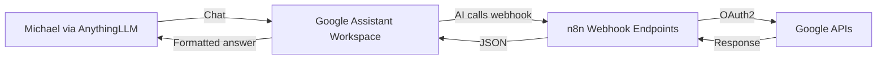
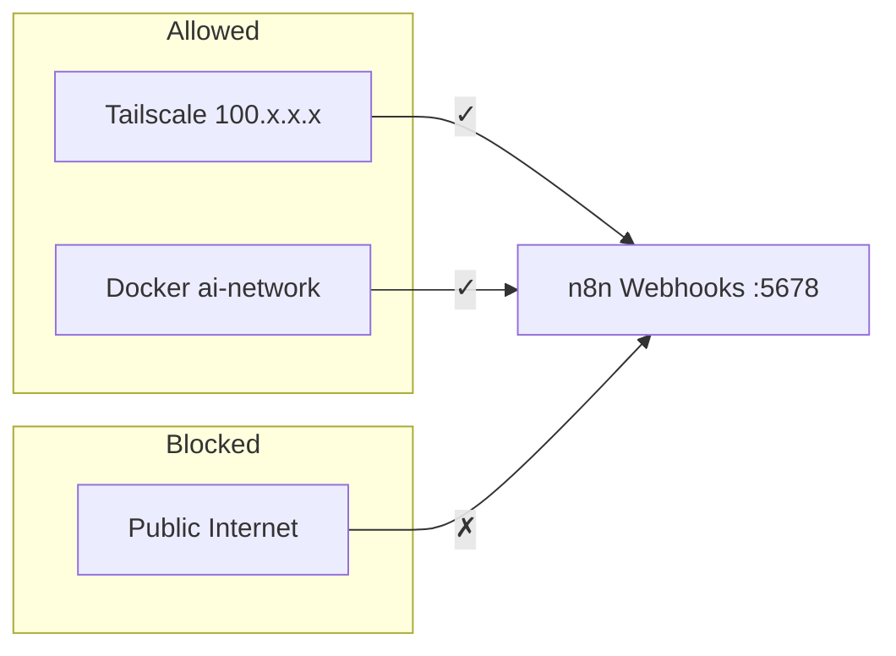
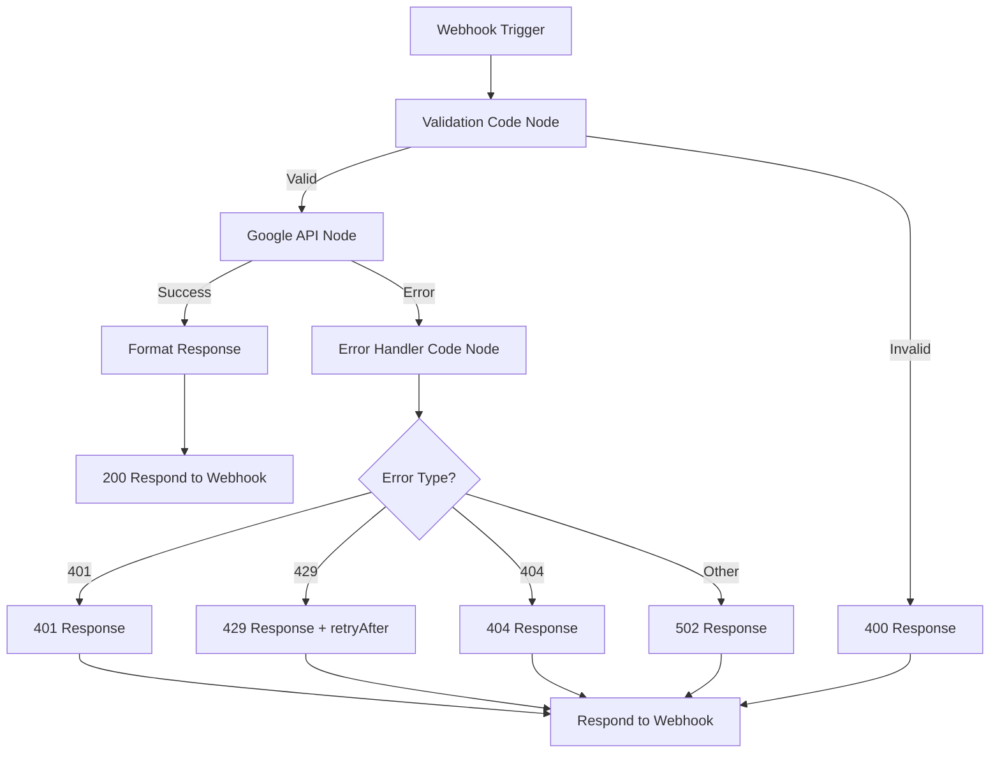

# Design Document: Google Assistant Integration

## Overview

This design connects Michael's Google account (Gmail, Calendar, Tasks, Contacts) to the 595BowersHub AI platform using the same webhook-first architecture proven in the Finance Workspace. n8n workflows expose Google data via HTTP endpoints, and a dedicated "Google Assistant" AnythingLLM workspace instructs the AI to call those webhooks for live data.

**Key architectural decisions:**

1. **n8n native Google nodes** handle all OAuth2 complexity (token storage, refresh, scope management) — no custom auth code
2. **Webhook-first pattern** (same as Finance): GET for reads, POST/PATCH/DELETE for writes
3. **No data persistence** — Google data passes through n8n transiently; nothing stored on disk or in a database
4. **Confirmation pattern in system prompt** — the AI drafts/previews write operations and only executes after Michael says yes
5. **Network-restricted access** — webhooks only accessible from Docker network and Tailscale (100.x.x.x)

**Scope:** 18 webhook endpoints across 4 Google services, one AnythingLLM workspace, one Google Cloud project, one n8n OAuth2 credential.

---

## Architecture

### High-Level Flow



### Component Diagram

```mermaid
graph TB
    subgraph "595BowersHub (Docker)"
        subgraph "AnythingLLM"
            WS[Google Assistant Workspace]
        end
        subgraph "n8n"
            CRED[Google OAuth2 Credential]
            subgraph "Gmail Workflows"
                GI[GET /gmail/inbox]
                GS[GET /gmail/search]
                GM[GET /gmail/message/:id]
                GL[GET /gmail/labels]
                GD[POST /gmail/draft]
                GSE[POST /gmail/send]
            end
            subgraph "Calendar Workflows"
                CT[GET /calendar/today]
                CU[GET /calendar/upcoming]
                CE[GET /calendar/events]
                CC[POST /calendar/create]
                CUP[PATCH /calendar/update/:id]
                CD[DELETE /calendar/delete/:id]
            end
            subgraph "Tasks Workflows"
                TL[GET /tasks/lists]
                TT[GET /tasks/list/:listId]
                TC[POST /tasks/create]
                TCO[PATCH /tasks/complete/:taskId]
                TD[DELETE /tasks/delete/:taskId]
            end
            subgraph "Contacts Workflows"
                CS[GET /contacts/search]
                CL[GET /contacts/list]
            end
        end
    end
    subgraph "External"
        GAPI[Google APIs]
        GCC[Google Cloud Console]
    end
    
    WS --> GI & GS & GM & GL & GD & GSE
    WS --> CT & CU & CE & CC & CUP & CD
    WS --> TL & TT & TC & TCO & TD
    WS --> CS & CL
    GI & GS & GM & GL & GD & GSE --> CRED
    CT & CU & CE & CC & CUP & CD --> CRED
    TL & TT & TC & TCO & TD --> CRED
    CS & CL --> CRED
    CRED --> GAPI
    GCC -.->|OAuth2 Client ID| CRED
```



### Network Security



All n8n webhooks listen on `0.0.0.0:5678` but the host firewall (UFW) and Docker network configuration restrict access to Tailscale and local Docker traffic only. This matches the existing Finance Workspace security model.

---

## Components and Interfaces

### 1. Google Cloud Console Project

**Purpose:** Provides OAuth2 Client ID and Client Secret for n8n to authenticate with Google APIs.

**Setup steps:**
1. Create project "595BowersHub" in Google Cloud Console
2. Enable APIs: Gmail API, Google Calendar API, Google Tasks API, Google People API
3. Configure OAuth consent screen (Internal or External with test user = Michael's email)
4. Create OAuth2 Client ID (Web application type)
5. Set Authorized redirect URI: `http://100.106.180.101:5678/rest/oauth2-credential/callback`

**OAuth2 Scopes required:**
| Scope | Purpose |
|-------|---------|
| `https://www.googleapis.com/auth/gmail.modify` | Read, send, draft emails |
| `https://www.googleapis.com/auth/calendar` | Read/write calendar events |
| `https://www.googleapis.com/auth/tasks` | Read/write tasks |
| `https://www.googleapis.com/auth/contacts.readonly` | Read contacts |

> **Design decision:** Using `gmail.modify` instead of separate `gmail.readonly` + `gmail.send` because n8n's Gmail node requires it for draft creation. This scope allows read, send, draft, and label operations but NOT delete.

### 2. n8n Google OAuth2 Credential

**Configuration in n8n UI:**
- **Credential Type:** Google OAuth2 API (or "Google" depending on node)
- **Client ID:** From Google Cloud Console
- **Client Secret:** From Google Cloud Console
- **Scopes:** All four scopes listed above (comma-separated)
- **Redirect URI:** Auto-populated by n8n: `http://100.106.180.101:5678/rest/oauth2-credential/callback`

n8n handles token refresh automatically. The credential is stored in n8n's encrypted SQLite credential store.

### 3. Webhook Endpoint Specifications

All webhooks share a base URL: `http://100.106.180.101:5678/webhook/`

#### 3.1 Gmail Webhooks

| Endpoint | Method | Parameters | Response |
|----------|--------|------------|----------|
| `/webhook/gmail/inbox` | GET | `maxResults` (optional, default 20, max 50) | Array of email summaries |
| `/webhook/gmail/search` | GET | `query` (required), `maxResults` (optional, default 20, max 50) | Array of email summaries |
| `/webhook/gmail/message/{id}` | GET | `id` in path | Full email object |
| `/webhook/gmail/labels` | GET | none | Array of label objects |
| `/webhook/gmail/draft` | POST | `to`, `subject`, `body` (all required) | Draft confirmation |
| `/webhook/gmail/send` | POST | `draftId` OR (`to`, `subject`, `body`) | Send confirmation |

#### 3.2 Calendar Webhooks

| Endpoint | Method | Parameters | Response |
|----------|--------|------------|----------|
| `/webhook/calendar/today` | GET | none | Array of today's events |
| `/webhook/calendar/upcoming` | GET | `days` (optional, default 7, max 30) | Array of upcoming events |
| `/webhook/calendar/events` | GET | `start` (required), `end` (required) — ISO 8601 | Array of events in range |
| `/webhook/calendar/create` | POST | `summary`, `start`, `end` (required); `location`, `description` (optional) | Created event |
| `/webhook/calendar/update/{id}` | PATCH | `id` in path; any of `summary`, `start`, `end`, `location`, `description` | Updated event |
| `/webhook/calendar/delete/{id}` | DELETE | `id` in path | Deletion confirmation |

#### 3.3 Tasks Webhooks

| Endpoint | Method | Parameters | Response |
|----------|--------|------------|----------|
| `/webhook/tasks/lists` | GET | none | Array of task lists |
| `/webhook/tasks/list/{listId}` | GET | `listId` in path, `showCompleted` (optional, default false) | Array of tasks |
| `/webhook/tasks/create` | POST | `title` (required); `listId`, `notes`, `due` (optional) | Created task |
| `/webhook/tasks/complete/{taskId}` | PATCH | `taskId` in path, `listId` (required query param) | Updated task |
| `/webhook/tasks/delete/{taskId}` | DELETE | `taskId` in path, `listId` (required query param) | Deletion confirmation |

#### 3.4 Contacts Webhooks

| Endpoint | Method | Parameters | Response |
|----------|--------|------------|----------|
| `/webhook/contacts/search` | GET | `query` (required) | Array of contacts (max 20) |
| `/webhook/contacts/list` | GET | `maxResults` (optional, default 50, max 200) | Array of contacts |

### 4. n8n Workflow Node Configurations

Each webhook endpoint is a separate n8n workflow following this pattern:

```
[Webhook Trigger] → [Validation (Code/IF)] → [Google Node] → [Format Response (Code)] → [Respond to Webhook]
```

For error handling, an additional branch:

```
[Google Node] → (on error) → [Error Response (Code)] → [Respond to Webhook]
```

#### Example: Gmail Inbox Workflow

```
Nodes:
1. Webhook (GET /webhook/gmail/inbox)
   - HTTP Method: GET
   - Path: gmail/inbox
   - Response Mode: "Using 'Respond to Webhook' Node"

2. Code (Validate & Set Params)
   - Extract maxResults from query params
   - Default to 20, cap at 50
   - Pass to next node

3. Gmail (Get Many Messages)
   - Credential: Google_OAuth2_Credential
   - Operation: Get Many
   - Limit: {{ $json.maxResults }}
   - Return All: false
   - Filters: Label = INBOX

4. Code (Format Response)
   - Map each message to: { id, from, to, subject, date, snippet, labels }
   - Return JSON array

5. Respond to Webhook
   - Response Code: 200
   - Response Body: formatted JSON array
```

#### Example: Calendar Create Workflow (Write with Validation)

```
Nodes:
1. Webhook (POST /webhook/calendar/create)
   - HTTP Method: POST
   - Path: calendar/create
   - Response Mode: "Using 'Respond to Webhook' Node"

2. Code (Validate Required Fields)
   - Check for summary, start, end
   - If missing: set error response with 400 status
   - If present: pass through

3. IF (Validation Passed?)
   - True → Google Calendar node
   - False → Error Respond to Webhook

4. Google Calendar (Create Event)
   - Credential: Google_OAuth2_Credential
   - Operation: Create
   - Calendar: primary
   - Summary: {{ $json.summary }}
   - Start: {{ $json.start }}
   - End: {{ $json.end }}
   - Additional Fields: location, description (if provided)

5. Code (Format Success Response)
   - Return: { id, summary, start, end, location, htmlLink }

6. Respond to Webhook (Success)
   - Response Code: 200
   - Response Body: formatted event JSON

7. Respond to Webhook (Error - Validation)
   - Response Code: 400
   - Response Body: { "error": "Missing required fields: ..." }

8. Respond to Webhook (Error - Google API)
   - Response Code: 502
   - Response Body: { "error": "Google Calendar API error: ..." }
```

#### Error Handling Branch (All Workflows)

Every Google node has `Continue On Fail` enabled with an error output that routes to:

```
[Google Node Error Output] → [Code: Format Error] → [Respond to Webhook: Error]
```

The error formatting code node inspects the error type:
- HTTP 401 from Google → return 401 with re-auth message
- HTTP 429 from Google → return 429 with retryAfter
- HTTP 404 from Google → return 404 with resource not found
- Any other → return 502 with upstream failure description

### 5. AnythingLLM Google Assistant Workspace

**Configuration:**
- **Name:** Google Assistant
- **Model:** claude-sonnet-4-5 (Anthropic API)
- **Temperature:** 0.7
- **Access:** Michael only (Manon excluded)
- **Embedding:** None (no documents to embed — all data is transient via webhooks)
- **System Prompt:** See full text in Data Models section below

---

## Data Models

### Webhook Response Schemas

#### Email Summary (Gmail inbox/search responses)
```json
{
  "id": "string (Gmail message ID)",
  "from": "string (sender email/name)",
  "to": "string (recipient email/name)",
  "subject": "string",
  "date": "string (ISO 8601)",
  "snippet": "string (first ~200 chars)",
  "labels": ["string"]
}
```

#### Full Email (Gmail message/{id} response)
```json
{
  "id": "string",
  "from": "string",
  "to": "string",
  "cc": "string | null",
  "bcc": "string | null",
  "subject": "string",
  "date": "string (ISO 8601)",
  "body": "string (plain text preferred, HTML fallback)",
  "labels": ["string"],
  "attachments": [
    {
      "filename": "string",
      "mimeType": "string",
      "size": "number (bytes)"
    }
  ]
}
```

#### Gmail Label
```json
{
  "id": "string",
  "name": "string",
  "type": "system | user"
}
```

#### Draft Confirmation
```json
{
  "draftId": "string",
  "to": "string",
  "subject": "string",
  "preview": "string (first 200 chars of body)"
}
```

#### Send Confirmation
```json
{
  "messageId": "string",
  "threadId": "string"
}
```

#### Calendar Event
```json
{
  "id": "string (Google Calendar event ID)",
  "summary": "string",
  "start": "string (ISO 8601)",
  "end": "string (ISO 8601)",
  "location": "string | null",
  "description": "string | null",
  "attendees": ["string (email)"],
  "htmlLink": "string (URL to event in Google Calendar)"
}
```

#### Task List
```json
{
  "id": "string",
  "title": "string",
  "updated": "string (ISO 8601)"
}
```

#### Task
```json
{
  "id": "string",
  "title": "string",
  "notes": "string | null",
  "due": "string (ISO 8601 date) | null",
  "status": "needsAction | completed",
  "completed": "string (ISO 8601) | null"
}
```

#### Contact
```json
{
  "name": "string",
  "email": "string | null",
  "phone": "string | null",
  "organization": "string | null"
}
```

#### Error Response (all endpoints)
```json
{
  "error": "string (human-readable description)",
  "retryAfter": "number (seconds) — only present on 429 responses"
}
```

### Google Assistant Workspace System Prompt

```text
You are Michael's personal Google Assistant running on 595BowersHub. You have access to live Google account data (Gmail, Calendar, Tasks, Contacts) through n8n webhook endpoints. ALWAYS call the appropriate webhook before answering any question about emails, calendar, tasks, or contacts. Do not guess or fabricate data — if you haven't called a webhook, you don't know the answer.

## Available Webhooks

### Gmail

#### GET http://100.106.180.101:5678/webhook/gmail/inbox
- Returns recent emails from inbox
- Optional param: maxResults (default 20, max 50)
- Use for: "check my email", "what's in my inbox", "any new emails"

#### GET http://100.106.180.101:5678/webhook/gmail/search?query=QUERY
- Returns emails matching Gmail search syntax
- Required param: query (same syntax as Gmail search bar)
- Optional param: maxResults (default 20, max 50)
- Use for: "find emails from John", "emails about project X", "unread emails"
- Examples: query=from:john@example.com, query=subject:invoice, query=is:unread

#### GET http://100.106.180.101:5678/webhook/gmail/message/{id}
- Returns full email body, headers, and attachment info
- Use for: "show me that email", "what does it say", reading full email content
- Get the id from inbox or search results first

#### GET http://100.106.180.101:5678/webhook/gmail/labels
- Returns all Gmail labels (system and user-created)
- Use for: "what labels do I have", organizing email queries

#### POST http://100.106.180.101:5678/webhook/gmail/draft
- Creates a draft email (does NOT send)
- Required body: { "to": "email", "subject": "text", "body": "text" }
- Use for: first step of sending an email — ALWAYS draft first, show preview, then send

#### POST http://100.106.180.101:5678/webhook/gmail/send
- Sends a draft or composes and sends directly
- Body option 1: { "draftId": "id" } — sends an existing draft
- Body option 2: { "to": "email", "subject": "text", "body": "text" } — direct send
- ⚠️ CONFIRMATION REQUIRED: Never call this without Michael's explicit approval

### Google Calendar

#### GET http://100.106.180.101:5678/webhook/calendar/today
- Returns all events for today (America/New_York timezone)
- Use for: "what's on my calendar today", "do I have anything today"

#### GET http://100.106.180.101:5678/webhook/calendar/upcoming?days=N
- Returns events from now through N days (default 7, max 30)
- Use for: "what's coming up this week", "next 3 days", "anything this weekend"

#### GET http://100.106.180.101:5678/webhook/calendar/events?start=DATE&end=DATE
- Returns events in a specific date range (ISO 8601 format)
- Required params: start, end (YYYY-MM-DD or full ISO 8601)
- Use for: "what's happening in July", "events between March 1 and March 15"

#### POST http://100.106.180.101:5678/webhook/calendar/create
- Creates a new calendar event
- Required body: { "summary": "text", "start": "ISO8601", "end": "ISO8601" }
- Optional: "location", "description"
- ⚠️ CONFIRMATION REQUIRED: Show event details and ask before creating

#### PATCH http://100.106.180.101:5678/webhook/calendar/update/{id}
- Updates an existing event (only send fields to change)
- Body: any of { "summary", "start", "end", "location", "description" }
- ⚠️ CONFIRMATION REQUIRED: Show what will change and ask before updating

#### DELETE http://100.106.180.101:5678/webhook/calendar/delete/{id}
- Deletes a calendar event
- ⚠️ CONFIRMATION REQUIRED: Show event details and ask before deleting

### Google Tasks

#### GET http://100.106.180.101:5678/webhook/tasks/lists
- Returns all task lists
- Use for: "what task lists do I have", "show my lists"

#### GET http://100.106.180.101:5678/webhook/tasks/list/{listId}
- Returns tasks in a specific list
- Optional param: showCompleted=true (default: false, only shows active tasks)
- Use for: "show my tasks", "what's on my to-do list"

#### POST http://100.106.180.101:5678/webhook/tasks/create
- Creates a new task
- Required body: { "title": "text" }
- Optional: "listId" (defaults to primary), "notes", "due" (YYYY-MM-DD)
- ✅ LOW RISK: Can create without confirmation

#### PATCH http://100.106.180.101:5678/webhook/tasks/complete/{taskId}?listId=ID
- Marks a task as completed
- Required param: listId
- ✅ LOW RISK: Can complete without confirmation

#### DELETE http://100.106.180.101:5678/webhook/tasks/delete/{taskId}?listId=ID
- Deletes a task permanently
- Required param: listId
- ⚠️ CONFIRMATION REQUIRED: Show task details and ask before deleting

### Google Contacts

#### GET http://100.106.180.101:5678/webhook/contacts/search?query=NAME
- Searches contacts by name or email
- Required param: query
- Returns: name, email, phone, organization (max 20 results)
- Use for: "what's John's email", "look up contact for..."

#### GET http://100.106.180.101:5678/webhook/contacts/list
- Returns contacts sorted alphabetically
- Optional param: maxResults (default 50, max 200)
- Use for: "show my contacts", "list all contacts"

## Write Operation Rules

### ⚠️ REQUIRES CONFIRMATION (always preview first, ask "Should I go ahead?"):
- Sending emails (always draft first → show preview → send only after "yes")
- Creating calendar events (show summary, date, time, location → ask)
- Updating calendar events (show what will change → ask)
- Deleting calendar events (show event being deleted → ask)
- Deleting tasks (show task being deleted → ask)

### ✅ LOW RISK (proceed without confirmation):
- Creating tasks
- Completing tasks

### Confirmation Flow for Emails:
1. Michael asks to send an email
2. You compose the email and call POST /webhook/gmail/draft
3. Show Michael the preview: To, Subject, Body preview
4. Ask: "Here's the draft. Should I send it, or would you like to change anything?"
5. Only if Michael says yes → call POST /webhook/gmail/send with the draftId
6. If Michael wants changes → modify and create a new draft, show again

### Confirmation Flow for Calendar/Tasks:
1. Michael asks to create/update/delete
2. Present a clear summary of what will happen
3. Ask: "Should I go ahead?"
4. Only proceed after explicit yes

## Cross-Reference Suggestions

When relevant, proactively suggest related lookups:
- Discussing a calendar event with attendees? Offer to look up their contact info
- Reading an email from someone? Offer to check calendar for meetings with them
- Creating a task from an email? Reference the email subject/sender

## Error Handling

If a webhook returns an error:
- **400**: Tell Michael what parameter was missing or invalid
- **401**: "Your Google connection needs to be refreshed. Open n8n at http://100.106.180.101:5678 and re-authorize the Google credential."
- **404**: "That item wasn't found — it may have been deleted or the ID is wrong."
- **429**: "Google's rate limit was hit. Wait a moment and try again."
- **502**: "Couldn't reach Google's servers. Check that n8n is running at http://100.106.180.101:5678."
- **500**: "Something unexpected went wrong. Check n8n logs for details."

## Context

- Timezone: America/New_York
- This workspace is for Michael only — Manon does not have access
- All Google data is transient — nothing is stored on disk or in a database
- Data comes live from Google APIs via n8n webhooks
- If you haven't called a webhook, you don't have the data — never fabricate
```

---


## Error Handling

### Error Response Strategy

All webhooks follow a consistent error response pattern:

```json
{
  "error": "Human-readable description of what went wrong"
}
```

For rate limit errors, an additional field:
```json
{
  "error": "Google API rate limit exceeded",
  "retryAfter": 60
}
```

### Error Classification and HTTP Status Codes

| Scenario | HTTP Status | Error Message Pattern |
|----------|-------------|----------------------|
| Missing required parameter | 400 | "Missing required field(s): {fields}" |
| Invalid email format | 400 | "Invalid email address format: {address}" |
| Invalid date range (start > end) | 400 | "Invalid date range: start must be before end" |
| Google OAuth2 token expired/invalid | 401 | "Google authentication expired. Re-authorize at http://100.106.180.101:5678" |
| Resource not found (event, task, message) | 404 | "{Resource type} not found: {id}" |
| Unrecognized webhook path | 404 | "Endpoint does not exist: {path}" |
| Google API rate limit (429 from Google) | 429 | "Google API rate limit exceeded" + retryAfter field |
| Unexpected internal error | 500 | "Internal error: {description}" (no stack traces) |
| Google API unreachable or error | 502 | "Google {service} API error: {description}" |

### n8n Error Handling Implementation

Each workflow uses this pattern:



**Error Handler Code Node logic (shared pattern across all workflows):**

```javascript
// Error handler - runs when Google node fails via "Continue On Fail"
const error = $input.first().json;
const statusCode = error.httpCode || error.statusCode || 502;
const message = error.message || 'Unknown upstream error';

if (statusCode === 401) {
  return {
    statusCode: 401,
    body: { error: 'Google authentication expired. Re-authorize at http://100.106.180.101:5678' }
  };
} else if (statusCode === 429) {
  const retryAfter = error.headers?.['retry-after'] || 60;
  return {
    statusCode: 429,
    body: { error: 'Google API rate limit exceeded', retryAfter: parseInt(retryAfter) }
  };
} else if (statusCode === 404) {
  return {
    statusCode: 404,
    body: { error: 'Resource not found' }
  };
} else {
  return {
    statusCode: 502,
    body: { error: `Google API error: ${message}` }
  };
}
```

### Validation Patterns

**Parameter validation (Code node at start of each workflow):**

```javascript
// Example: Calendar events endpoint validation
const query = $input.first().json.query;
const start = query.start;
const end = query.end;

if (!start || !end) {
  const missing = [];
  if (!start) missing.push('start');
  if (!end) missing.push('end');
  return { valid: false, statusCode: 400, body: { error: `Missing required field(s): ${missing.join(', ')}` } };
}

if (new Date(start) > new Date(end)) {
  return { valid: false, statusCode: 400, body: { error: 'Invalid date range: start must be before end' } };
}

return { valid: true, start, end };
```

**Email validation (for draft/send endpoints):**

```javascript
// Email format validation
const emailRegex = /^[^\s@]+@[^\s@]+\.[^\s@]+$/;
const body = $input.first().json.body;

const missing = [];
if (!body.to) missing.push('to');
if (!body.subject) missing.push('subject');
if (!body.body) missing.push('body');

if (missing.length > 0) {
  return { valid: false, statusCode: 400, body: { error: `Missing required field(s): ${missing.join(', ')}` } };
}

if (!emailRegex.test(body.to)) {
  return { valid: false, statusCode: 400, body: { error: `Invalid email address format: ${body.to}` } };
}

return { valid: true, ...body };
```

### Security Constraints on Error Responses

- Error responses MUST NOT include OAuth2 tokens, refresh tokens, or credential material
- Error responses MUST NOT include stack traces or internal n8n node IDs
- Error responses MUST NOT include the full Google API error response (which may contain token info)
- Error messages SHOULD be actionable for Michael (tell him what to do, not just what failed)

---

## Testing Strategy

### Why Property-Based Testing Does Not Apply

This feature consists of:
1. **Infrastructure configuration** — Google Cloud Console project, OAuth2 setup
2. **n8n workflow wiring** — visual workflows connecting webhook triggers to Google API nodes
3. **System prompt text** — natural language instructions for the AI
4. **External service integration** — all logic lives in Google's APIs and n8n's built-in nodes

There are no pure functions, parsers, serializers, algorithms, or business logic that varies meaningfully with input. The "code" is configuration (n8n workflows) and prose (system prompt). Property-based testing is not applicable.

### Testing Approach

#### 1. Manual Integration Testing (Primary)

Each webhook endpoint should be tested with curl from the Tailscale network:

**Gmail endpoints:**
```bash
# Inbox
curl "http://100.106.180.101:5678/webhook/gmail/inbox?maxResults=5"

# Search
curl "http://100.106.180.101:5678/webhook/gmail/search?query=is:unread"

# Message detail (use an ID from inbox response)
curl "http://100.106.180.101:5678/webhook/gmail/message/MSG_ID_HERE"

# Labels
curl "http://100.106.180.101:5678/webhook/gmail/labels"

# Draft (POST)
curl -X POST "http://100.106.180.101:5678/webhook/gmail/draft" \
  -H "Content-Type: application/json" \
  -d '{"to":"michael@example.com","subject":"Test","body":"Test body"}'

# Send draft
curl -X POST "http://100.106.180.101:5678/webhook/gmail/send" \
  -H "Content-Type: application/json" \
  -d '{"draftId":"DRAFT_ID_HERE"}'
```

**Calendar endpoints:**
```bash
# Today
curl "http://100.106.180.101:5678/webhook/calendar/today"

# Upcoming 3 days
curl "http://100.106.180.101:5678/webhook/calendar/upcoming?days=3"

# Date range
curl "http://100.106.180.101:5678/webhook/calendar/events?start=2025-07-01&end=2025-07-31"

# Create event
curl -X POST "http://100.106.180.101:5678/webhook/calendar/create" \
  -H "Content-Type: application/json" \
  -d '{"summary":"Test Event","start":"2025-07-15T10:00:00-04:00","end":"2025-07-15T11:00:00-04:00"}'

# Update event
curl -X PATCH "http://100.106.180.101:5678/webhook/calendar/update/EVENT_ID" \
  -H "Content-Type: application/json" \
  -d '{"summary":"Updated Event Name"}'

# Delete event
curl -X DELETE "http://100.106.180.101:5678/webhook/calendar/delete/EVENT_ID"
```

**Tasks endpoints:**
```bash
# Lists
curl "http://100.106.180.101:5678/webhook/tasks/lists"

# Tasks in list
curl "http://100.106.180.101:5678/webhook/tasks/list/LIST_ID?showCompleted=true"

# Create task
curl -X POST "http://100.106.180.101:5678/webhook/tasks/create" \
  -H "Content-Type: application/json" \
  -d '{"title":"Test task","due":"2025-07-20"}'

# Complete task
curl -X PATCH "http://100.106.180.101:5678/webhook/tasks/complete/TASK_ID?listId=LIST_ID"

# Delete task
curl -X DELETE "http://100.106.180.101:5678/webhook/tasks/delete/TASK_ID?listId=LIST_ID"
```

**Contacts endpoints:**
```bash
# Search
curl "http://100.106.180.101:5678/webhook/contacts/search?query=John"

# List
curl "http://100.106.180.101:5678/webhook/contacts/list?maxResults=10"
```

#### 2. Error Case Testing

```bash
# Missing required param (expect 400)
curl "http://100.106.180.101:5678/webhook/gmail/search"

# Invalid date range (expect 400)
curl "http://100.106.180.101:5678/webhook/calendar/events?start=2025-12-31&end=2025-01-01"

# Non-existent resource (expect 404)
curl "http://100.106.180.101:5678/webhook/gmail/message/FAKE_ID_12345"

# Non-existent endpoint (expect 404)
curl "http://100.106.180.101:5678/webhook/gmail/nonexistent"

# Missing required fields on POST (expect 400)
curl -X POST "http://100.106.180.101:5678/webhook/gmail/draft" \
  -H "Content-Type: application/json" \
  -d '{"to":"test@example.com"}'

# Invalid email format (expect 400)
curl -X POST "http://100.106.180.101:5678/webhook/gmail/draft" \
  -H "Content-Type: application/json" \
  -d '{"to":"not-an-email","subject":"Test","body":"Test"}'
```

#### 3. Security Testing

```bash
# Verify no tokens leak in responses
curl -s "http://100.106.180.101:5678/webhook/gmail/inbox" | grep -i "token\|bearer\|refresh"
# Should return nothing

# Verify webhook is NOT accessible from public internet
# (test from a non-Tailscale device — should timeout or connection refused)
```

#### 4. Smoke Tests (Post-Deployment Checklist)

| # | Test | Expected Result |
|---|------|-----------------|
| 1 | GET /webhook/gmail/inbox | 200 with array of emails |
| 2 | GET /webhook/gmail/labels | 200 with array of labels |
| 3 | GET /webhook/calendar/today | 200 with array (may be empty) |
| 4 | GET /webhook/tasks/lists | 200 with at least one list |
| 5 | GET /webhook/contacts/list?maxResults=5 | 200 with array of contacts |
| 6 | GET /webhook/gmail/search (no query param) | 400 with error message |
| 7 | POST /webhook/gmail/draft (valid payload) | 200 with draftId |
| 8 | Delete test draft via Gmail UI | Manual cleanup |

#### 5. AnythingLLM Workspace Validation

Manual conversational testing in the Google Assistant workspace:

| # | User Input | Expected AI Behavior |
|---|-----------|---------------------|
| 1 | "Check my inbox" | Calls GET /gmail/inbox, shows email list |
| 2 | "What's on my calendar today?" | Calls GET /calendar/today, shows events |
| 3 | "Send an email to test@example.com about dinner" | Drafts first, shows preview, asks for confirmation |
| 4 | "Add a task: buy groceries" | Creates task immediately (low risk) |
| 5 | "Delete that task" | Shows task details, asks for confirmation |
| 6 | "What's John's email?" | Calls GET /contacts/search?query=John |
| 7 | Trigger error (disable workflow) | Shows helpful error with n8n URL |
