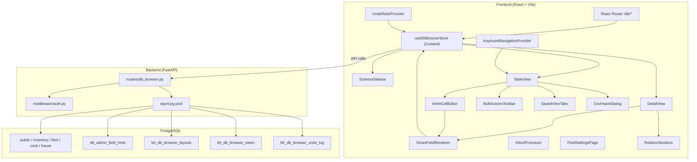

# Design Document: Native DB Browser

## Overview

The Native DB Browser replaces the standalone Flask-based DB Admin app (port 5002) with a React-based database management interface built directly into BowersHub AI. It provides full schema introspection, CRUD operations, smart field rendering, image management, layout customization, inbox processing, and schema management — all unified under BowersHub AI's auth, theming, and navigation system.

### Design Goals

- **Feature parity** with the existing DB Admin (`db-admin/app.py`) — zero regression on functionality
- **Database-driven configuration** — no hardcoded field-to-widget mappings in frontend code
- **Mobile-first responsive** — works well on Pixel 9 Pro via the PWA
- **Unified auth** — JWT-protected endpoints using existing `get_current_user` / `require_admin` middleware
- **Theme-reactive** — uses CSS custom properties exclusively, no hardcoded colors
- **Minimal bundle impact** — code-split the DB browser route so it doesn't affect chat page load

### Key Design Decisions

| Decision | Rationale |
|----------|-----------|
| Single FastAPI router (`backend/routers/db_browser.py`) | Follows dashboard router pattern; keeps all DB browser endpoints grouped |
| Zustand store for DB browser state | Matches existing project conventions (dashboard.ts, auth.ts) |
| Server-side sort/filter/search | Tables can have thousands of rows; client-side doesn't scale |
| Layout configs stored in Postgres (`bh_db_browser_layouts`) | Per the NO HARDCODING rule; not localStorage |
| Fraction display is render-only | DB stores decimals; the fraction ↔ decimal conversion is purely UI |
| Lazy-loaded route with `React.lazy` | DB browser is a large feature; shouldn't penalize chat startup |
| Server-side undo log (`bh_db_browser_undo_log`) | Survives page refresh within session; avoids client-side state loss |
| Session-scoped undo via UUID token | Isolates undo stacks per browser tab; no cross-session conflicts |
| Inline editing uses SmartFieldRenderer compact mode | Reuses existing field logic; consistent behavior between inline and detail editing |
| Saved views stored per-user per-table in Postgres | Per the NO HARDCODING rule; views travel with the user, not the browser |
| CSV import uses server-side row-by-row insert with error collection | Partial failures don't block valid rows; user gets actionable error report |
| Relation discovery via information_schema FK introspection | Dynamic — works for any new table without code changes |

## Architecture



### Request Flow

1. User navigates to `/db` → React Router mounts the lazy-loaded `DbBrowserPage`
2. `useDbBrowserStore.loadSchemas()` fires → `GET /api/db/schemas` (parallel introspection)
3. User selects a table → store calls `GET /api/db/:schema/:table/rows` with pagination/sort/filter params
4. User clicks a row → navigates to `/db/:schema/:table/:id`, store calls `GET /api/db/:schema/:table/rows/:id`
5. SmartFieldRenderer reads field hints from the store (cached from `GET /api/db/field-hints`) and renders appropriate widgets
6. Save → `PATCH /api/db/:schema/:table/:id` with changed fields only (dirty tracking)

### Inline Editing Flow

1. User clicks a cell (or presses Enter on a focused cell) → store sets `editingCell: { row, col }`
2. Table_View mounts `InlineCellEditor` in that cell position, rendering SmartFieldRenderer in `compact` mode
3. User edits the value, then triggers save via:
   - **Blur**: saves immediately via PATCH
   - **Enter**: saves + moves `focusedCell` down one row (same column)
   - **Tab**: saves + moves `focusedCell` to next editable cell in row
   - **Escape**: discards changes, unmounts editor, returns to static display
4. On successful save, the previous value is pushed to the server-side undo log via the PATCH response
5. On failure (constraint violation), cell reverts to previous value + toast error

### Undo/Redo Flow

1. On page mount, an `UndoRedoProvider` generates a session UUID (stored in memory only)
2. Every PATCH/POST/DELETE call includes the session token in a header (`X-DB-Session-Id`)
3. The backend writes an entry to `bh_db_browser_undo_log` with: session_id, schema, table, row_id, operation_type, previous_values (JSONB), new_values (JSONB), created_at
4. Ctrl+Z → `POST /api/db/undo` (with session header) → backend reads the latest non-undone entry for this session, reverses the operation (PATCH/DELETE/INSERT), marks the entry as undone
5. Ctrl+Shift+Z → `POST /api/db/redo` → backend reads the latest undone entry, re-applies the operation
6. Navigating away from `/db` → `POST /api/db/undo/clear-session` to purge the log for this session

## Components and Interfaces

### Backend: `backend/routers/db_browser.py`

All endpoints are prefixed with `/api/db` and require JWT auth via `get_current_user`. Write operations additionally require `require_admin`.

#### Schema & Table Introspection

| Endpoint | Method | Auth | Description |
|----------|--------|------|-------------|
| `/api/db/schemas` | GET | user | Returns all user schemas with tables, column counts, row counts, and link-table presence |
| `/api/db/:schema/:table/columns` | GET | user | Column metadata (name, type, nullable, default, FK info) |
| `/api/db/:schema/:table/pk` | GET | user | Primary key column(s) for the table |

#### CRUD Operations

| Endpoint | Method | Auth | Description |
|----------|--------|------|-------------|
| `/api/db/:schema/:table/rows` | GET | user | Paginated rows with sort, filter, search params |
| `/api/db/:schema/:table/rows/:id` | GET | user | Single row by PK |
| `/api/db/:schema/:table/rows` | POST | admin | Insert new row |
| `/api/db/:schema/:table/rows/:id` | PATCH | admin | Update row fields |
| `/api/db/:schema/:table/rows/:id` | DELETE | admin | Hard delete row |

#### Image Management

| Endpoint | Method | Auth | Description |
|----------|--------|------|-------------|
| `/api/db/:schema/:table/rows/:id/images` | GET | user | Get linked images for a row |
| `/api/db/:schema/:table/rows/:id/images` | POST | admin | Upload and link image |
| `/api/db/:schema/:table/rows/:id/images/reorder` | PUT | admin | Reorder images |
| `/api/db/:schema/:table/rows/:id/images/:asset_id` | DELETE | admin | Unlink image |
| `/api/db/:schema/:table/rows/:id/images/:asset_id/primary` | PUT | admin | Set primary image |

#### Layout & Configuration

| Endpoint | Method | Auth | Description |
|----------|--------|------|-------------|
| `/api/db/layouts/:schema/:table` | GET | user | Per-table layout config |
| `/api/db/layouts/:schema/:table` | PUT | admin | Save layout config |
| `/api/db/field-hints` | GET | user | All field hint records |
| `/api/db/field-hints/:column_name` | PUT | admin | Upsert field hint |
| `/api/db/field-hints/:column_name` | DELETE | admin | Delete field hint |

#### Lookup & Search

| Endpoint | Method | Auth | Description |
|----------|--------|------|-------------|
| `/api/db/:schema/:table/lookup-options/:column` | GET | user | FK dropdown options (id + display label) |
| `/api/db/:schema/:table/lookup-options/:column?search=term` | GET | user | Type-ahead search for large tables (>200 rows) |

#### Schema Management (DDL)

| Endpoint | Method | Auth | Description |
|----------|--------|------|-------------|
| `/api/db/schemas` | POST | admin | Create schema |
| `/api/db/tables` | POST | admin | Create table (with optional link table) |
| `/api/db/tables/:schema/:table` | PATCH | admin | Rename, move schema, add/drop column |
| `/api/db/tables/:schema/:table/preview` | POST | admin | SQL preview without executing |

#### Bulk Operations

| Endpoint | Method | Auth | Description |
|----------|--------|------|-------------|
| `/api/db/:schema/:table/bulk-delete` | POST | admin | Delete multiple rows by IDs |
| `/api/db/:schema/:table/bulk-edit` | POST | admin | Update a single field on multiple rows |

#### Saved Views

| Endpoint | Method | Auth | Description |
|----------|--------|------|-------------|
| `/api/db/views/:schema/:table` | GET | user | List saved views for the current user and table |
| `/api/db/views/:schema/:table` | POST | user | Create a new saved view |
| `/api/db/views/:schema/:table/:view_id` | PATCH | user | Rename a saved view |
| `/api/db/views/:schema/:table/:view_id` | DELETE | user | Delete a saved view |

#### Undo/Redo

| Endpoint | Method | Auth | Description |
|----------|--------|------|-------------|
| `/api/db/undo` | POST | admin | Undo the last operation for the current session |
| `/api/db/redo` | POST | admin | Redo the last undone operation for the current session |
| `/api/db/undo/clear-session` | POST | admin | Clear the undo log for the current session |

#### CSV Import/Export

| Endpoint | Method | Auth | Description |
|----------|--------|------|-------------|
| `/api/db/:schema/:table/export-csv` | GET | user | Export rows as CSV (respects active filters/search) |
| `/api/db/:schema/:table/import-csv` | POST | admin | Import CSV with column mapping (multipart form data) |

#### Relations

| Endpoint | Method | Auth | Description |
|----------|--------|------|-------------|
| `/api/db/:schema/:table/:id/relations` | GET | user | Get related records from all tables that reference this table via FK |

#### Inbox Processing

| Endpoint | Method | Auth | Description |
|----------|--------|------|-------------|
| `/api/db/inbox/files` | GET | user | List inbox directory files |
| `/api/db/inbox/tables` | GET | user | Tables with image support |
| `/api/db/inbox/process` | POST | admin | Create row + link photos |
| `/api/db/inbox/ai-extract` | POST | admin | Proxy to Smart Capture extract |
| `/api/db/inbox/url-extract` | POST | admin | Proxy to URL scrape pipeline |
| `/api/db/inbox/knowledge` | POST | admin | Create knowledge note |

### Frontend Components

```
frontend/src/
├── pages/
│   └── DbBrowserPage.tsx          # Top-level layout: sidebar + content
├── components/db-browser/
│   ├── SchemaSidebar.tsx           # Schema/table tree with context menu
│   ├── TableView.tsx               # Paginated row list with sort/filter/search
│   ├── DetailView.tsx              # Single-row edit form
│   ├── SmartFieldRenderer.tsx      # Renders appropriate widget per field hint (supports compact prop)
│   ├── InlineCellEditor.tsx        # Mounts SmartFieldRenderer in compact mode within a table cell
│   ├── KeyboardNavigationProvider.tsx  # Context provider: tracks focused cell, handles key events
│   ├── UndoRedoProvider.tsx        # Context/hook: manages session, undo/redo stack, Ctrl+Z/Shift+Z
│   ├── BulkActionsToolbar.tsx      # Floating toolbar when rows are selected (Delete, Edit, Export)
│   ├── BulkEditDialog.tsx          # Field picker + value setter for bulk edit operation
│   ├── SavedViewTabs.tsx           # Tab bar above table: view names + save/rename/delete
│   ├── CsvImportDialog.tsx         # File upload + column mapping preview + commit
│   ├── RelationSections.tsx        # Expandable related record sections in Detail_View
│   ├── fields/
│   │   ├── TextField.tsx
│   │   ├── NumberField.tsx
│   │   ├── FractionField.tsx       # Fraction ↔ decimal display/input
│   │   ├── SelectField.tsx         # Dropdown (static options or FK lookup)
│   │   ├── BooleanField.tsx        # Yes/No toggle
│   │   ├── DateField.tsx           # Native date picker
│   │   ├── UrlField.tsx            # URL input + external link icon
│   │   ├── TextareaField.tsx       # Resizable textarea
│   │   └── LookupField.tsx         # FK dropdown with type-ahead + link
│   ├── FilterBuilder.tsx           # Multi-condition filter UI
│   ├── ColumnSettings.tsx          # Column visibility/order panel
│   ├── LayoutSettings.tsx          # Detail view field order/width/visibility
│   ├── ImageGallery.tsx            # Thumbnails, upload, reorder, primary, unlink
│   ├── CreateTableDialog.tsx       # Schema/name/columns builder + SQL preview
│   ├── CreateRowDialog.tsx         # New row form using SmartFieldRenderer
│   ├── InboxProcessor.tsx          # Photo selection + target table + AI fill
│   ├── FieldSettingsPage.tsx       # Field hint configuration UI
│   └── WelcomeState.tsx            # Landing state when no table selected
├── stores/
│   └── db-browser.ts              # Zustand store for all DB browser state
└── hooks/
    ├── useDbSchemas.ts             # Schema/table data fetching
    ├── useTableRows.ts             # Row fetching with pagination/sort/filter
    ├── useFieldHints.ts            # Field hint cache
    ├── useKeyboardNavigation.ts    # Hook for consuming KeyboardNavigationProvider
    └── useUndoRedo.ts              # Hook for consuming UndoRedoProvider
```

### Zustand Store Shape

```typescript
interface DbBrowserState {
  // Schema tree
  schemas: SchemaInfo[]
  schemasLoading: boolean
  
  // Active table
  activeSchema: string | null
  activeTable: string | null
  columns: ColumnMeta[]
  
  // Rows
  rows: Record<string, any>[]
  totalRows: number
  filteredRows: number
  page: number
  pageSize: number
  sortColumn: string | null
  sortDirection: 'asc' | 'desc' | null
  filters: FilterCondition[]
  searchTerm: string
  
  // Detail view
  activeRow: Record<string, any> | null
  dirtyFields: Set<string>
  
  // Layout
  layouts: Record<string, LayoutConfig>
  
  // Field hints (cached globally)
  fieldHints: Record<string, FieldHint>
  
  // Inline editing (Req 25)
  editingCell: { row: number; col: number } | null
  
  // Keyboard navigation (Req 26)
  focusedCell: { row: number; col: number } | null
  
  // Bulk selection (Req 27)
  selectedRows: Set<string>  // Set of primary key values
  lastSelectedRowIndex: number | null  // For shift-click range selection
  
  // Saved views (Req 28)
  views: SavedView[]
  activeViewId: string | null
  
  // Undo/Redo (Req 29) — client-side tracking mirrors server log
  undoStack: UndoEntry[]
  redoStack: UndoEntry[]
  sessionId: string | null  // UUID generated on mount, sent with every write request
  
  // Actions
  loadSchemas: () => Promise<void>
  selectTable: (schema: string, table: string) => Promise<void>
  loadRows: () => Promise<void>
  setPage: (page: number) => void
  setPageSize: (size: number) => void
  setSort: (column: string) => void
  setFilters: (filters: FilterCondition[]) => void
  setSearch: (term: string) => void
  loadRow: (id: string) => Promise<void>
  saveRow: (updates: Record<string, any>) => Promise<void>
  createRow: (values: Record<string, any>) => Promise<any>
  deleteRow: (id: string) => Promise<void>
  loadFieldHints: () => Promise<void>
  saveLayout: (schema: string, table: string, config: LayoutConfig) => Promise<void>
  
  // Inline editing actions
  startEditing: (row: number, col: number) => void
  stopEditing: () => void
  saveCellValue: (rowId: string, column: string, value: any) => Promise<void>
  
  // Keyboard navigation actions
  setFocusedCell: (cell: { row: number; col: number } | null) => void
  moveFocus: (direction: 'up' | 'down' | 'left' | 'right') => void
  moveFocusTab: (reverse?: boolean) => void
  
  // Bulk selection actions
  toggleRowSelection: (rowId: string) => void
  toggleAllRows: () => void
  selectRange: (fromIndex: number, toIndex: number) => void
  clearSelection: () => void
  bulkDelete: (rowIds: string[]) => Promise<void>
  bulkEdit: (rowIds: string[], column: string, value: any) => Promise<void>
  
  // Saved view actions
  loadViews: () => Promise<void>
  activateView: (viewId: string | null) => void
  saveView: (name: string) => Promise<void>
  renameView: (viewId: string, name: string) => Promise<void>
  deleteView: (viewId: string) => Promise<void>
  
  // Undo/redo actions
  undo: () => Promise<void>
  redo: () => Promise<void>
  clearUndoStack: () => void
  
  // CSV actions
  exportCsv: () => Promise<void>
  importCsv: (file: File, columnMapping: Record<string, string>) => Promise<ImportResult>
  
  // Relations
  loadRelations: (id: string) => Promise<RelationGroup[]>
}
```

## Data Models

### New Migration: `bh_db_browser_layouts`

```sql
CREATE TABLE public.bh_db_browser_layouts (
    id          SERIAL PRIMARY KEY,
    user_id     INTEGER NOT NULL REFERENCES public.bh_users(id) ON DELETE CASCADE,
    schema_name TEXT NOT NULL,
    table_name  TEXT NOT NULL,
    list_config JSONB NOT NULL DEFAULT '{}',    -- column order, visibility for list view
    detail_config JSONB NOT NULL DEFAULT '{}',  -- field order, visibility, width, height for detail view
    updated_at  TIMESTAMPTZ NOT NULL DEFAULT now(),
    UNIQUE (user_id, schema_name, table_name)
);

CREATE INDEX ON public.bh_db_browser_layouts (user_id);
```

### New Migration: `bh_db_browser_views`

```sql
CREATE TABLE public.bh_db_browser_views (
    id          UUID PRIMARY KEY DEFAULT gen_random_uuid(),
    user_id     INTEGER NOT NULL REFERENCES public.bh_users(id) ON DELETE CASCADE,
    schema_name TEXT NOT NULL,
    table_name  TEXT NOT NULL,
    name        TEXT NOT NULL,
    config      JSONB NOT NULL DEFAULT '{}',
    -- config shape: { filters: FilterCondition[], sortColumn: string | null,
    --                  sortDirection: 'asc' | 'desc' | null, columns: { name, visible, position }[] }
    created_at  TIMESTAMPTZ NOT NULL DEFAULT now(),
    updated_at  TIMESTAMPTZ NOT NULL DEFAULT now()
);

CREATE INDEX ON public.bh_db_browser_views (user_id, schema_name, table_name);
```

### New Migration: `bh_db_browser_undo_log`

```sql
CREATE TABLE public.bh_db_browser_undo_log (
    id              BIGSERIAL PRIMARY KEY,
    session_id      UUID NOT NULL,                -- client-generated per page mount
    user_id         INTEGER NOT NULL REFERENCES public.bh_users(id) ON DELETE CASCADE,
    schema_name     TEXT NOT NULL,
    table_name      TEXT NOT NULL,
    row_id          TEXT NOT NULL,                 -- PK of the affected row (text for flexibility)
    operation_type  TEXT NOT NULL CHECK (operation_type IN ('update', 'insert', 'delete', 'bulk_update')),
    previous_values JSONB,                        -- row state before the operation (null for inserts)
    new_values      JSONB,                        -- row state after the operation (null for deletes)
    is_undone       BOOLEAN NOT NULL DEFAULT false,
    created_at      TIMESTAMPTZ NOT NULL DEFAULT now()
);

CREATE INDEX ON public.bh_db_browser_undo_log (session_id, created_at DESC);
CREATE INDEX ON public.bh_db_browser_undo_log (session_id, is_undone);
```

### Existing Table: `db_admin_field_hints`

```sql
-- Already exists in public schema:
-- id, column_name (unique), input_type, options, prefix, suffix,
-- min_val, max_val, step, placeholder
```

### TypeScript Interfaces

```typescript
interface SchemaInfo {
  name: string
  tables: TableInfo[]
}

interface TableInfo {
  name: string
  column_count: number
  row_count: number
  has_link_table: boolean
}

interface ColumnMeta {
  column_name: string
  data_type: string
  is_nullable: string
  column_default: string | null
  is_pk: boolean
  fk_schema?: string
  fk_table?: string
  fk_column?: string
}

interface FieldHint {
  column_name: string
  input_type: 'text' | 'number' | 'fraction' | 'select' | 'url' | 'date' | 'boolean' | 'textarea'
  options: string[] | null
  prefix: string | null
  suffix: string | null
  min_val: number | null
  max_val: number | null
  step: number | null
  placeholder: string | null
}

interface FilterCondition {
  column: string
  operator: 'eq' | 'neq' | 'contains' | 'gt' | 'lt' | 'is_null' | 'has_value'
  value: string
}

interface LayoutConfig {
  list: {
    columns: { name: string; visible: boolean; position: number }[]
  }
  detail: {
    fields: { name: string; visible: boolean; position: number; width: 25 | 33 | 50 | 100; height: 'small' | 'medium' | 'large' }[]
  }
}

interface SavedView {
  id: string
  name: string
  schema_name: string
  table_name: string
  config: {
    filters: FilterCondition[]
    sortColumn: string | null
    sortDirection: 'asc' | 'desc' | null
    columns: { name: string; visible: boolean; position: number }[]
  }
  created_at: string
  updated_at: string
}

interface UndoEntry {
  id: number
  session_id: string
  schema_name: string
  table_name: string
  row_id: string
  operation_type: 'update' | 'insert' | 'delete' | 'bulk_update'
  previous_values: Record<string, any> | null
  new_values: Record<string, any> | null
  is_undone: boolean
}

interface RelationGroup {
  schema: string
  table: string
  fk_column: string
  total_count: number
  rows: Record<string, any>[]  // limited to 5
}

interface ImportResult {
  total_rows: number
  imported_rows: number
  failed_rows: { line_number: number; error: string }[]
}
```

### SmartFieldRenderer Compact Mode

The SmartFieldRenderer accepts a `compact: boolean` prop that controls inline vs full rendering:

| Aspect | Normal Mode (Detail_View) | Compact Mode (Inline Cell) |
|--------|--------------------------|---------------------------|
| Label | Shown above input | Hidden (column header serves as label) |
| Height | Variable (respects layout height setting) | Fixed ~36px to match table row height |
| Width | Respects layout width (25/33/50/100%) | Fills cell width |
| Padding | Standard form spacing | Minimal (2px horizontal) |
| Borders | Full border with focus ring | No border at rest; focus ring on activation |
| Save trigger | Explicit Save button | Blur, Enter, or Tab |

Field types that cannot render in compact mode (e.g., textarea with large height, image gallery) fall back to a read-only display with a "click to edit in detail view" indicator.

### Keyboard Navigation Architecture

The `KeyboardNavigationProvider` wraps `TableView` and manages:

1. **focusedCell state** — `{ row: number; col: number }` coordinates relative to the visible page
2. **Visual focus indicator** — a CSS ring (`outline: 2px solid var(--color-primary)`) applied to the focused cell via a data attribute
3. **Key event handling** (when NOT in edit mode):
   - `ArrowUp/Down/Left/Right` — move focusedCell within grid bounds
   - `Enter` — activate `editingCell` at the focused position
   - `Tab` / `Shift+Tab` — move to next/previous editable cell, wrapping at row boundaries
   - `Ctrl+N` — open CreateRowDialog
   - `Ctrl+D` — duplicate the row at focusedCell
   - `Ctrl+F` — focus the search input
   - `Delete` — open delete confirmation for the focused row
4. **Editable cell detection** — columns are editable if they are NOT: primary key, `created_at`, `updated_at`, `archived_at`, or have `is_pk: true` in column metadata
5. **Tab-wrapping logic** — when Tab reaches the last editable cell in a row, focus wraps to the first editable cell of the next row (and vice versa for Shift+Tab)

### Bulk Operations Architecture

1. **Selection model** — `selectedRows: Set<string>` stores PK values of selected rows
2. **Shift-click range** — `lastSelectedRowIndex` tracks the last individually-clicked row; Shift+click selects all rows between `lastSelectedRowIndex` and the clicked index
3. **Header checkbox** — toggles all visible rows (current page only); indeterminate state when partial selection
4. **BulkActionsToolbar** — floats at bottom of TableView when `selectedRows.size > 0`:
   - Shows count: "3 rows selected"
   - Buttons: Delete, Edit Field, Export CSV
5. **Bulk delete** — `POST /api/db/:schema/:table/bulk-delete` with body `{ ids: string[] }`. Confirmation dialog shows exact count. Each deleted row is logged to the undo log as a separate entry (for individual undo).
6. **Bulk edit** — `POST /api/db/:schema/:table/bulk-edit` with body `{ ids: string[], column: string, value: any }`. The BulkEditDialog presents a column picker (excluding PK/timestamps) and renders SmartFieldRenderer for the selected column to set the new value. The server logs one undo entry per affected row.

### Saved Views Architecture

1. **Tab bar** — `SavedViewTabs` renders above the table: "All" (default, always present, not deletable) + one tab per saved view
2. **View config** — stores: `filters`, `sortColumn`, `sortDirection`, `columns` (visibility + order)
3. **Activating a view** — applies the stored config to the store state (setFilters, setSort, and column visibility). This triggers `loadRows()` which re-fetches from the server with the new params.
4. **Saving a view** — captures current filters, sort, and column visibility from the store. Prompts for a name. Calls `POST /api/db/views/:schema/:table`.
5. **Context menu on tab** — right-click or long-press shows: Rename, Delete. "All" tab has no context menu.
6. **Per-user, per-table** — views are scoped to the authenticated user and the specific schema+table combination

### CSV Import/Export Architecture

**Export:**
1. `GET /api/db/:schema/:table/export-csv` accepts the same filter/sort/search query params as the rows endpoint
2. Returns `Content-Type: text/csv` with `Content-Disposition: attachment; filename="{schema}_{table}.csv"`
3. First row is column headers (respects column visibility if provided)
4. All matching rows are streamed (no pagination limit for export)

**Import:**
1. `POST /api/db/:schema/:table/import-csv` accepts multipart form data: `file` (CSV) + `mapping` (JSON string)
2. Mapping shape: `{ "csv_column_name": "table_column_name" | null }` — null means skip
3. Backend parses CSV, applies mapping, casts values using the same `cast_value()` logic as regular inserts
4. Inserts rows one-by-one in a transaction; on constraint violation, records the error and continues
5. Returns `{ total_rows, imported_rows, failed_rows: [{ line_number, error }] }`

**CsvImportDialog flow:**
1. User selects a `.csv` file → frontend parses headers + first 5 rows for preview
2. Mapping UI: each CSV column gets a dropdown of table columns (+ "Skip" option). Auto-maps by name match.
3. Preview table shows mapped values with type indicators
4. "Import" button sends to the API; progress shown; results displayed with success/error counts

### Relation Views Architecture

1. **Discovery** — `GET /api/db/:schema/:table/:id/relations` queries `information_schema.table_constraints` and `information_schema.key_column_usage` to find all tables with FK columns referencing the current table
2. **Response shape** — `RelationGroup[]`: one entry per referencing table, containing: schema, table, fk_column, total_count, and up to 5 most recent rows (ordered by PK descending)
3. **UI** — `RelationSections` renders below the main form in DetailView. Each section is an expandable accordion:
   - Header: related table name + count badge
   - Body: compact mini-table (3-4 key columns)
   - "View all" link → navigates to `/db/:schema/:relatedTable` with a pre-applied filter (`fk_column = current_row_id`)
   - "Add" button → opens CreateRowDialog for the related table with the FK field pre-filled and read-only

### SmartFieldRenderer Resolution Logic

The SmartFieldRenderer determines which widget to render for a column using this priority chain:

1. **Field Hint exists** → use the `input_type` from `db_admin_field_hints`
2. **FK constraint detected** → render LookupField (dropdown from referenced table)
3. **Postgres type fallback** → map data_type to default widget:
   - `text`, `character varying` → TextField
   - `integer`, `bigint`, `smallint` → NumberField (step=1)
   - `numeric`, `real`, `double precision` → NumberField
   - `boolean` → BooleanField
   - `date` → DateField
   - `timestamp*` → DateField (datetime mode)
   - `uuid` → TextField (read-only)
   - Everything else → TextField

### Fraction ↔ Decimal Conversion

The `FractionField` component handles bidirectional conversion:

- **Display**: `0.375` → `"3/8\""` (uses a lookup table of common woodworking fractions: 1/64, 1/32, 1/16, 3/32, 1/8, 5/32, 3/16, 7/32, 1/4, ... up to 63/64, then whole numbers)
- **Input**: Accepts `"3/8"`, `"3/8\""`, `"0.375"`, or `".375"` — parses all forms to decimal
- **Storage**: Always stores the decimal value in the database

### Lookup Display Column Selection

When rendering FK dropdowns, the system selects a "display column" from the referenced table:

1. Check for columns named `name`, `title`, `description` (in that priority order)
2. If none found, use the first `text`/`varchar` column
3. If no text columns exist, use the PK column value as the label

For tables with >200 rows, the dropdown switches to a type-ahead search mode, calling the lookup-options endpoint with a `?search=` parameter.

## Correctness Properties

*A property is a characteristic or behavior that should hold true across all valid executions of a system — essentially, a formal statement about what the system should do. Properties serve as the bridge between human-readable specifications and machine-verifiable correctness guarantees.*

### Property 1: Sidebar tables are alphabetically sorted within each schema

*For any* set of tables within a schema, the Schema_Sidebar SHALL render them in alphabetical (lexicographic) order by table name.

**Validates: Requirements 2.2**

### Property 2: Pagination invariants

*For any* total row count and page size, the API response SHALL satisfy: `rows.length <= pageSize`, `totalPages == Math.ceil(totalRows / pageSize)`, and `offset == (page - 1) * pageSize`.

**Validates: Requirements 3.1, 3.3**

### Property 3: Sort ordering correctness

*For any* dataset and sort column, when sort is applied ascending, every row[i][sortCol] <= row[i+1][sortCol] (with nulls last). When descending, every row[i][sortCol] >= row[i+1][sortCol] (with nulls last).

**Validates: Requirements 4.1, 4.5**

### Property 4: Filter predicate satisfaction

*For any* set of filter conditions applied with AND logic, every row in the result set SHALL satisfy ALL active filter predicates simultaneously.

**Validates: Requirements 5.2, 5.3, 5.5**

### Property 5: Text search inclusion

*For any* search term and result row, at least one text-type column in that row SHALL contain the search term as a case-insensitive substring.

**Validates: Requirements 6.2, 6.5**

### Property 6: Smart field hint resolution

*For any* column with a saved Field_Hint record, the SmartFieldRenderer SHALL produce a widget matching the configured `input_type`, ignoring the column's Postgres data type.

**Validates: Requirements 8.1, 24.1**

### Property 7: Fraction round-trip conversion

*For any* decimal value representable as a fraction with denominator ≤ 64, converting to display string and parsing back SHALL produce the original decimal value.

**Validates: Requirements 8.3**

### Property 8: Type-based fallback rendering

*For any* column with no Field_Hint and no FK constraint, the SmartFieldRenderer SHALL produce a widget determined solely by the column's Postgres data type according to the defined type-to-widget mapping.

**Validates: Requirements 24.3**

### Property 9: Duplicate row field preservation

*For any* row, duplicating it SHALL produce a new record where all fields except the primary key and timestamp columns (`created_at`, `updated_at`, `archived_at`) are equal to the source row's values.

**Validates: Requirements 13.1, 13.3**

### Property 10: Layout configuration round-trip

*For any* valid layout configuration object, saving it via `PUT /api/db/layouts/:schema/:table` and immediately retrieving it via `GET /api/db/layouts/:schema/:table` SHALL return an equivalent configuration.

**Validates: Requirements 10.5, 24.2**

### Property 11: Lookup display column selection

*For any* referenced table, the lookup display column SHALL be the first column named `name`, `title`, or `description` (in that priority), or the first text-type column if none of those exist.

**Validates: Requirements 17.2**

### Property 12: Field hint round-trip

*For any* valid field hint configuration, saving it via `PUT /api/db/field-hints/:column_name` and retrieving it via `GET /api/db/field-hints` SHALL return the saved configuration unchanged.

**Validates: Requirements 18.4, 18.5**

### Property 13: Inline edit save persistence

*For any* valid field value and editable cell, after saving via inline edit (PATCH), re-fetching the row SHALL return the updated value in the corresponding column.

**Validates: Requirements 25.5**

### Property 14: Bulk edit consistency

*For any* set of selected rows, a target column, and a valid value, after bulk edit completes, all affected rows SHALL have the target field set to the specified value.

**Validates: Requirements 27.5**

### Property 15: Undo reversal

*For any* single data operation (cell edit, row creation, row deletion, or bulk edit), performing an undo SHALL return the affected row(s) to their exact pre-operation state.

**Validates: Requirements 29.1, 29.2, 29.3, 29.4**

### Property 16: CSV export/import round-trip

*For any* table with rows, exporting to CSV and re-importing with an identity column mapping SHALL produce rows with equivalent values for all mapped columns.

**Validates: Requirements 30.1, 30.4**

### Property 17: Saved view filter application

*For any* saved view configuration, activating that view SHALL produce the same result set as manually applying its stored filters, sort order, and column visibility to the table.

**Validates: Requirements 28.3**

### Property 18: Relation discovery completeness

*For any* table, the relations endpoint SHALL return ALL tables in the database that have at least one foreign key column referencing the target table's primary key.

**Validates: Requirements 31.1, 31.5**

## Error Handling

### Backend Error Strategy

| Error Type | HTTP Status | Response Shape |
|-----------|-------------|----------------|
| Table/schema not found | 404 | `{ "detail": "Table inventory.nonexistent not found" }` |
| Constraint violation (FK, unique, check) | 400 | `{ "detail": "Unique constraint violated: column 'name' value already exists" }` |
| Unauthorized (no/invalid JWT) | 401 | `{ "detail": "Not authenticated" }` |
| Forbidden (non-admin write) | 403 | `{ "detail": "Admin access required" }` |
| Invalid column/type in DDL | 400 | `{ "detail": "Invalid column name: ..." }` |
| SQL execution failure | 500 | `{ "detail": "Database error: ..." }` |

### Constraint Violation Translation

The backend SHALL parse asyncpg constraint errors and produce human-readable messages:

```python
def translate_constraint_error(e: asyncpg.exceptions.PostgresError) -> str:
    if isinstance(e, asyncpg.UniqueViolationError):
        return f"A record with this value already exists (constraint: {e.constraint_name})"
    if isinstance(e, asyncpg.ForeignKeyViolationError):
        return f"Referenced record does not exist (constraint: {e.constraint_name})"
    if isinstance(e, asyncpg.NotNullViolationError):
        return f"Field '{e.column_name}' cannot be empty"
    if isinstance(e, asyncpg.CheckViolationError):
        return f"Value does not meet validation rules (constraint: {e.constraint_name})"
    return f"Database error: {str(e)}"
```

### Frontend Error Strategy

- API errors are caught in the Zustand store actions and exposed as `error` state
- Toast notifications display the human-readable error message from the API
- Optimistic updates are NOT used for DB writes (data integrity > perceived speed)
- Network failures show a retry prompt with the original action
- Form validation errors highlight the specific field with the error message

### Non-Admin Read-Only Mode

When a non-admin user accesses the DB browser:
- All write-related UI controls (Save, Add Row, Delete, Create Table, etc.) are hidden
- The `require_admin` dependency on write endpoints returns 403 as a safety net
- The store tracks `isAdmin` from the auth context and passes it to components

## Testing Strategy

### Property-Based Tests (Vitest + fast-check)

Property-based testing is appropriate for this feature because there are pure functions with clear input/output behavior (fraction conversion, filter predicate evaluation, field hint resolution, pagination math, sort verification) and the input space is large.

**Configuration:**
- Library: `fast-check` with Vitest
- Minimum 100 iterations per property test
- Tag format: `Feature: native-db-browser, Property {N}: {title}`

**Tests to implement:**

1. Fraction conversion round-trip (Property 7)
2. Pagination math invariants (Property 2)
3. Filter predicate satisfaction (Property 4) — using in-memory row filtering function
4. Text search inclusion (Property 5) — using the search matcher function
5. Smart field hint resolution (Property 6) — resolver function + random hint configs
6. Type-based fallback rendering (Property 8) — resolver function + random column metadata
7. Duplicate row field preservation (Property 9) — row clone function
8. Layout config round-trip (Property 10) — serialization/deserialization
9. Lookup display column selection (Property 11) — column selection algorithm
10. Field hint round-trip (Property 12) — serialization
11. Sort ordering correctness (Property 3) — comparator function
12. Sidebar alphabetical ordering (Property 1) — sort function
13. Inline edit save persistence (Property 13) — PATCH + re-fetch round-trip
14. Bulk edit consistency (Property 14) — bulk update + per-row verification
15. Undo reversal (Property 15) — operation + undo + state comparison
16. CSV export/import round-trip (Property 16) — export → parse → import → compare
17. Saved view filter application (Property 17) — apply view config vs manual filter application
18. Relation discovery completeness (Property 18) — FK introspection vs relation endpoint

### Unit Tests (Vitest)

- SmartFieldRenderer: renders correct widget per hint/type/FK (example-based)
- SmartFieldRenderer compact mode: renders inline-sized widget per field type
- FilterBuilder: UI adds/removes conditions correctly
- Pagination controls: correct page numbers displayed
- CreateTableDialog: SQL preview generation
- Layout settings: drag-and-drop state updates
- InlineCellEditor: mounts/unmounts on editingCell state change
- KeyboardNavigationProvider: arrow keys move focusedCell within bounds
- BulkActionsToolbar: appears when selectedRows > 0, shows correct count
- BulkEditDialog: column picker excludes PK/timestamps, renders SmartFieldRenderer for selected column
- SavedViewTabs: renders All tab + saved views, context menu on right-click
- CsvImportDialog: parses CSV headers, auto-maps by name, preview renders correctly
- RelationSections: renders expandable accordions with mini-tables
- UndoRedoProvider: Ctrl+Z/Ctrl+Shift+Z call correct API endpoints

### Integration Tests (Vitest + supertest or httpx)

- Full CRUD cycle: create → read → update → delete row
- Schema introspection: verify response matches actual DB state
- Image upload/link/unlink flow
- DDL operations: create table with link table, rename, move schema
- Auth enforcement: verify 401/403 on protected endpoints
- Constraint violation error messages
- Bulk delete: verify all targeted rows removed, undo log entries created
- Bulk edit: verify all targeted rows updated to new value
- Saved views CRUD: create → list → rename → delete; verify per-user scoping
- Undo/redo cycle: edit → undo → verify revert → redo → verify re-apply
- Undo log session isolation: operations from session A are not visible to session B
- CSV export: verify output matches filtered rows with correct headers
- CSV import: verify rows inserted, partial failure handling (valid rows succeed, invalid rows reported)
- Relations endpoint: verify FK discovery across schemas, correct row limits, total counts

### E2E Tests (Playwright — future)

- Navigate to /db, select table, sort, filter, search
- Edit row, save, verify persistence
- Create table with columns, verify in sidebar
- Inbox processing flow (mocked AI)
- Mobile viewport: sidebar drawer, single-column detail
- Inline cell editing: click cell, edit, Tab to next, verify saved values
- Keyboard navigation: arrow keys move focus ring, Enter activates editing
- Bulk operations: select multiple rows, bulk delete with confirmation
- Saved views: create view with filters, switch between views, verify data changes
- Undo/redo: edit cell → Ctrl+Z → verify revert → Ctrl+Shift+Z → verify re-apply
- CSV round-trip: export table, re-import, verify data matches
- Relations: open detail view, verify relation sections show linked records

### Test Data Strategy

- Use a dedicated test schema (`test_db_browser`) created/dropped in test setup/teardown
- Seed with predictable data for integration tests
- Property tests use generated data via fast-check arbitraries
