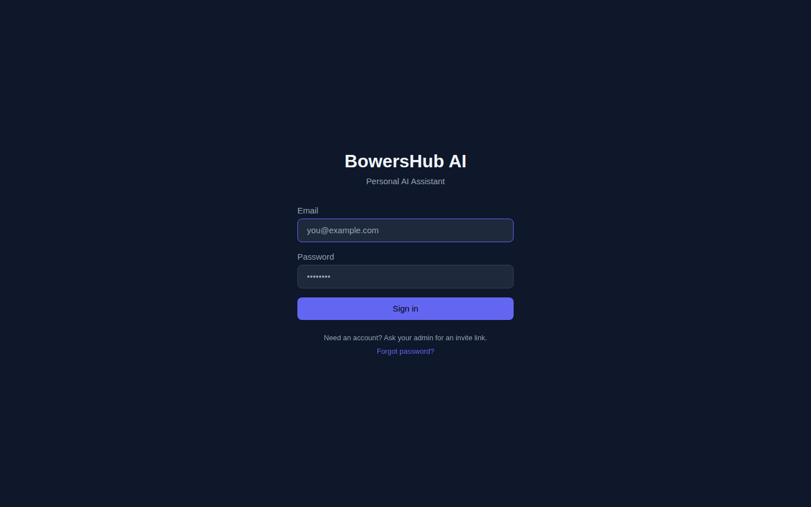
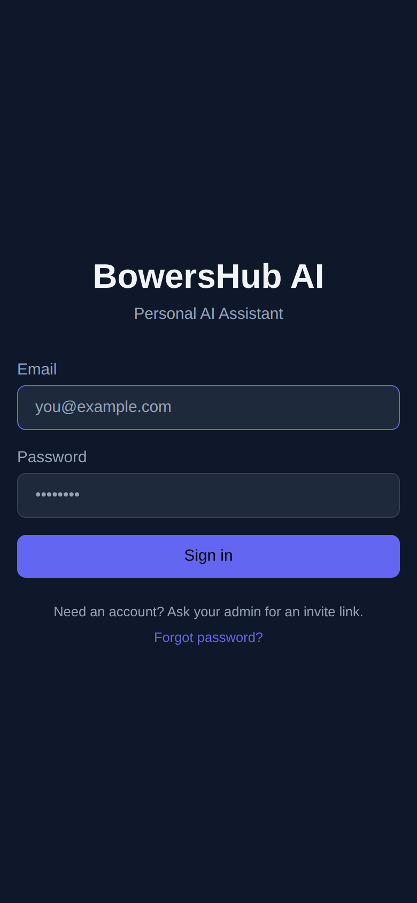

<div align="center">

# 🏠 BowersHub AI

### A self-hosted, private AI assistant & home-management platform

*One PWA on your phone — personal finance, groceries & household lists, knowledge, and a genuinely useful AI assistant. All private, all on-prem, reachable anywhere over Tailscale.*

<br/>

[](https://fastapi.tiangolo.com/)
[](https://react.dev/)
[](https://www.postgresql.org/)
[](https://www.anthropic.com/)
[](https://ollama.com/)
[](#-progressive-web-app)
[](#-security--privacy)

</div>

---

## 📸 Screenshots

| Desktop | Mobile |
|---|---|
|  |  |

> Authenticated views (dashboard, chat, lists, finance, settings) are captured against a **seeded local test stack** rather than the live app (which holds real finances). Regenerate any view at both viewports with the Playwright capture script — see [`docs/screenshots/`](docs/screenshots/README.md).

---

## ✨ What it does

BowersHub is a **single installable app** that replaces a pile of separate services with one private, AI-native hub:

| Area | Highlights |
|---|---|
| 🤖 **AI assistant** | Streaming chat with multi-turn tool use, native + web search, voice in/out, and background "context capture" that quietly remembers facts you state. |
| 💰 **Personal finance** | Bank sync, transactions, bulk + AI categorization, budgets, net worth, recurring detection, retirement planner, natural-language "ask your finances," and AI insights. |
| 🛒 **Lists & groceries** | Household-shared shopping / to-do / packing lists — add by chat ("add milk to the list") or in the UI; check off collaboratively. |
| 🔔 **Notifications** | Per-user web-push + Pushover, quiet hours, budget / inbox / reminder / game-day alerts — each member configures their own. |
| 🏡 **Household / multi-user** | Michael & Manon share workspaces, finance, and context with separate logins and a capability-based authorization ladder. |
| 🎨 **Theming** | Per-user, device-synced themes (incl. a true-black OLED theme), an in-app theme builder, and a custom app-icon library. |
| 🗄️ **Data browser** | A built-in, role-scoped database browser with favorites, search, and an `ask-db` natural-language SQL sandbox. |
| 🧠 **Semantic memory** | pgvector + RRF hybrid retrieval over a personal knowledge base (`remember` / `recall`). |

Everything user-facing — slash commands, skills, flags, themes, model lists — is **DB-driven, not hardcoded**: adding a command or model is a database row, read via API.

---

## 🧭 Architecture

```
┌─────────────────────────────────────────────────────────┐
│                    BowersHub AI (PWA)                     │
│        React 18 · Vite · TailwindCSS · WebSocket         │
└──────────────────────────┬──────────────────────────────┘
                           │  REST + WS (Bearer JWT)
┌──────────────────────────▼──────────────────────────────┐
│                  FastAPI Backend (Python)                 │
│  ┌─────────┐  ┌─────────┐  ┌──────────────────────┐      │
│  │   L1    │  │   L2    │  │         L3           │      │
│  │ Pattern │→ │ Haiku   │→ │  Opus + Tool Use     │      │
│  │ Match   │  │Classify │  │  (streaming, search) │      │
│  └────┬────┘  └────┬────┘  └──────────┬───────────┘      │
│       └────────────┴──────────────────┘                  │
│              Native Python Skills (native://)            │
│   weather · sports · news · lists · email · finance …    │
│  ┌──────────┐ ┌───────────┐ ┌───────────┐ ┌───────────┐  │
│  │  Ollama  │ │ Anthropic │ │apscheduler│ │  pgvector │  │
│  │(local LLM)│ │  (cloud)  │ │ (cron)    │ │ (memory)  │  │
│  └──────────┘ └───────────┘ └───────────┘ └───────────┘  │
└──────────────────────────┬───────────────────────────────┘
                           │
        ┌──────────────────┼──────────────────┐
   ┌────▼────┐       ┌──────▼──────┐     ┌─────▼─────┐
   │Postgres │       │  Filewriter │     │    n8n    │
   │+pgvector│       │ (files/IMAP)│     │(scheduled)│
   └─────────┘       └─────────────┘     └───────────┘
```

### Key design patterns

- **3-layer message routing** — every message takes the cheapest path that can answer it: **L1** deterministic slash-commands / regex (free), **L2** Haiku intent-classification → one skill, **L3** Opus with multi-turn tool use, streaming, and web search.
- **Native skill migration** — skills start as n8n webhooks and migrate to in-process Python one at a time (`native://` URLs), with instant rollback. Each returns a pre-formatted `_display` so output looks great through any layer.
- **Local + cloud hybrid** — background work (categorization, embeddings, dedup) runs on local Ollama (free, private); interactive reasoning uses Claude. Typical AI cost: a few dollars a month.
- **DB-driven everything** — slash commands, skills, models, themes, capabilities are rows, not constants (the "NO HARDCODING" rule).
- **Forward-only migrations** — `backend/migrations/*.sql`, auto-applied on startup, rebuildable from an empty DB.

---

## 🚀 Quickstart (development)

> The app is `bowershub-ai/` (FastAPI backend + React PWA). A working dev environment is already provisioned; see [`CLAUDE.md`](CLAUDE.md) for the canonical setup.

```bash
# ── Backend (FastAPI, Python) ──────────────────────────────
cd bowershub-ai
.venv/bin/python -m pip install -r requirements.txt -r requirements-test.txt
PYTHONPATH=. .venv/bin/python -m pytest -q          # tests (DB-backed need Postgres)

# ── Frontend (React + Vite + TS) ───────────────────────────
cd bowershub-ai/frontend
npm run dev        # dev server, proxies /api + /ws → :5003
npm test           # vitest
npx tsc --noEmit   # typecheck
npm run build      # production build
```

Configuration lives in `.env` files on the server (never committed) — see the `.env.example` files for required variables (Anthropic key, DB creds, VAPID / Pushover for notifications, SimpleFin for bank sync, Gmail IMAP, etc.).

---

## 🧩 Skills & slash commands

Skills are DB rows (`bh_skills`) dispatched by the router; many have natural-language and slash-command entry points.

| Command | Does |
|---|---|
| `/help` | List available commands |
| `/list` | Shopping / to-do / packing lists (also: *"add milk to the list"*) |
| `/weather`, `/news`, `/sports` | Live weather, headlines, scores & schedules |
| `/spend`, `/transactions`, `/balance`, `/categorize` | Finance lookups & categorization |
| `/remember`, `/recall` | Save / search the knowledge base (semantic memory) |
| `/remind`, `/schedule`, `/briefing` | Reminders, calendar, morning briefing |
| `/email` | Inbox digest, cleanup, unsubscribe finder |

Add a command or skill = insert a row. No redeploy of constants.

---

## 📱 Progressive Web App

Installable on iOS/Android/desktop: offline-tolerant service worker, web-push notifications, share-target ("share to BowersHub" → Quick Capture), and a custom, swappable app icon. Reachable from anywhere over **Tailscale** with an HTTPS cert — no ports exposed to the internet.

---

## 🔒 Security & privacy

- **Self-hosted on a mini-PC**, private by default — your finances and household data never leave your hardware (except the model calls you opt into).
- **Tailscale-only access** + Caddy HTTPS; nothing public-facing.
- **Capability-based authz** with scoped Postgres roles (`finance_reader`, migration/runtime privilege split) and an `ask-db` SQL sandbox (sqlglot-validated, read-only).
- **Per-user auth** (JWT access/refresh, bcrypt, password policy, rate-limited login, audit log).

---

## 🛠️ Stack

- **Backend** — Python 3.12, FastAPI, asyncpg, httpx, APScheduler
- **Frontend** — React 18, TypeScript, Vite, TailwindCSS, Zustand, React-Aria
- **Database** — PostgreSQL 16 + pgvector (multi-schema: `public`, `finance`, `inventory`, …)
- **AI** — Anthropic Claude (Opus 4.8 / Haiku), Ollama (local), pgvector hybrid retrieval (RRF)
- **Infra** — Docker Compose, Tailscale, Caddy, forward-only SQL migrations, CI

---

## 📂 Project structure

```
bowershub-ai/            — Main app (FastAPI + React PWA)
  backend/
    routers/             — REST endpoints (auth, finance, lists, settings, …)
    services/            — Routing engine, native skills, model providers
    migrations/          — Forward-only Postgres migrations (auto-applied)
    websocket/           — Real-time chat
    tests/               — pytest (DB-backed + pure property tests)
  frontend/
    src/pages/           — Dashboard, Chat, Lists, Finance, Settings, Admin
    src/components/       — UI (design-system primitives in components/ui)
    src/stores/          — Zustand state
docs/                    — Cutover notes, screenshots, how-tos
scripts/                 — deploy.sh, backups, cert renewal
.kiro/                   — Spec-driven workflow (specs + steering)
```

---

## 🧪 Development

```bash
# Backend tests (DB-backed need a reachable Postgres)
cd bowershub-ai && PYTHONPATH=. .venv/bin/python -m pytest -q
# Pure property tests (no DB):
PYTHONPATH=. .venv/bin/python -m pytest backend/tests/properties -q

# Frontend
cd bowershub-ai/frontend && npm test && npx tsc --noEmit
```

Migrations are forward-only SQL files in `backend/migrations/`, auto-applied on startup. This repo is developed with two agentic tools sharing one repo (Kiro IDE + Claude Code) — see [`CLAUDE.md`](CLAUDE.md) and the running [`context-log.md`](context-log.md) handoff journal.

---

## 🗺️ Roadmap

The north star is *the world's best personal-assistant / home-management server* — finance is one module under it.

- **Grocery/Lists v2** *(next up)* — store dropdown, department/aisle grouping, sort options, user-created shared lists.
- **Finance product** — Monarch/Origin-style UI, AI-native insights, forecasting, a retirement planner.
- **Provider-independent web search** — a client-side search tool (today web search is Anthropic-coupled).
- **Cheaper model routing** — push more high-volume work to local Ollama / batch.

---

## 💰 Cost

~$30/month total — Anthropic API (a few $), SimpleFin bank sync, electricity; Ollama / Postgres / n8n / self-hosting are free.

## 📄 License

Personal project, published as a **reference architecture** for anyone building their own private AI assistant stack.
